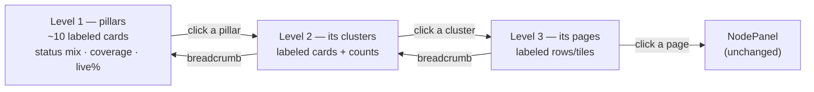

# Content-plan map view — REBUILD (focused session WITH Arman)

**What this is:** rebuild the content-plan `?view=map` surface from scratch so a non-technical
site owner can actually see, judge, and act on a 300+ page plan — replacing the current
dot-cloud graph that communicates nothing.
**Scope:** Program
**Feature:** Content Plan
**Vision:** `common-docs/projects/content-engine/STATE.md` §2.12 + §4.2A + ledger Q14

## Vision — Arman's words

> "this entire UI is completely garbage and has to be rebuilt. It's totally useless and makes no
> sense and it's clear no agent has ever actually used it and tested it!!!! It needs massive work
> that's much bigger than this question. They need to do a big focused session on it."
> — Q14, 2026-08-20

> "The UI is for seeing, deciding, and correcting — agents do the bulk writing." · "NOT a
> pretty-but-useless graph" — §2.12

The bar to meet: the node workspace next door — *"it's an amazing design!"* (Q14). This rebuild
**must be worked in a live session with Arman** — do not design it by mail (workspace-root rule,
2026-08-20).

## What actually using it showed (2026-08-20, 295-node plan, localhost:3001 + code read)

Driven with real data: `http://localhost:3001/marketing/content-plan/f8e332bb-df0e-4772-9288-48b548803afe?view=map`
(prpinjectionmd.com, 295 nodes — the largest plan the test admin can see; Arman's 341-node
All Green URL is org `5dc930e9` AI Matrx, which `admin@admin.com` has no membership in).

1. ~~Arman's exact URL renders a SILENT EMPTY CANVAS for every test agent.~~ **FIXED
   2026-08-20:** the workbench renders `<AccessGate token="web_site">` (verified in the browser
   as the no-membership admin: named site, owner, org, request-access) and the header collapses
   to a back-only chevron. Test agents on Arman's URL now see an honest denial, not a blank map.
2. **The default view is information-free at real scale.** Radial layout constants
   (`RADIAL_MIN_RING_GAP=260`, min arc 120px) spread 295 nodes over a huge canvas; fitView lands
   at zoom ≈0.05–0.1 where every node is a ~3px dot. Semantic zoom hides article/cluster labels
   at far/mid bands, and pillar labels (10px, zoom-scaled) are sub-pixel — so **nothing on the
   canvas is readable, and all dots are the same blue** when statuses are uniform (the common
   real case: everything "Planned").
3. **Edges are invisible** (1px, muted/0.5) at any zoom below ~0.8, so the one thing a radial
   graph could show — which cluster belongs to which pillar — is absent. The rings read as
   decoration.
4. **Zoom is broken as an experience.** Mouse wheel PANS (`panOnScroll`) — first scroll flings
   the graph off-screen; the +/− controls move ~1.2x per animated click (26 clicks measured to
   get from fit to zoom 0.5); double-click is overloaded (collapse on pillars, zoom elsewhere).
5. **"Collapse pillars" and layout switches never re-fit the viewport** — the graph shrinks to a
   clump floating in empty space (`key={layoutId}` remount races; collapse changes bounds with no
   fitView), and the user must find the fit button.
6. **Tidy-tree layout at this scale fits as a 1-node-wide vertical string of dots**; pillar
   columns is the only structured one and is still unlabeled at fit.
7. **No search, no counts, no summary.** The tree view has search/filter-with-counts/"N pages";
   the map has six bare filter dropdowns and no way to find a page by name — on the surface whose
   whole job is orientation.
8. **Real writes with no guard at illegible zoom:** drag-stop within 70 *flow*-px of another node
   = instant reparent (at zoom 0.1 that's a 7px screen slip); shift-drag + Apply = bulk status
   write. No confirm, no undo, on a surface where you cannot read what you grabbed.
9. **Native `title` tooltips only** — the panel's own doctrine (FEATURE.md flow 2) already bans
   `title=`; the map's sole hover detail never appears on touch.
10. **What works:** click → canonical NodePanel opens (slow, races the click); the pure layout
    fns are unit-tested; filters do filter; legend is honest. The plumbing is fine — the
    *presentation model* is wrong.

**Root cause, one sentence:** the map encodes five dimensions on individual dots (a graph-viz
answer) when the user's jobs — "what does this plan cover, where are the gaps, what state is each
area in, take me to a page" — need **aggregation-first, readable-at-every-altitude** presentation.

## Resources

- Code: `features/marketing/content-plan/components/PillarMap.tsx` (618 lines, all of it) +
  `components/pillar-map/` (layouts.ts pure + tested, PlanMapNode.tsx, MapLegend.tsx). Mounted via
  `next/dynamic({ssr:false})` in `ContentPlanWorkbench.tsx:103` + `:929`.
- Doctrine to hold: `features/marketing/content-plan/FEATURE.md` (flow 3 = current map, flow 2 =
  NodePanel contract), `no-dead-ends` skill, THE FLOATING LAW, Canvas Doctrine.
- The bar: `/marketing/content-plan/nodes/<nodeId>` (Current | Plan | Studio — confirmed
  "amazing"); the tree view's toolbar (`PlanTreeToolbar.tsx`) already solved search/filter/counts.
- Test data: site `f8e332bb-df0e-4772-9288-48b548803afe` (295 nodes, org the test admin is in);
  Arman's: `d0aff5b6-0710-4848-8304-164db3c80ab7` (341 nodes, AI Matrx org — needs his account or
  an org membership). Login: canonical admin creds or `/api/dev-login?token=$DEV_LOGIN_TOKEN`.
- Aggregates are cheap: the whole plan is already client-loaded; pillar/cluster roll-ups
  (status mix, keyword coverage, live %, pipeline progress) are pure client math.

## Remaining work

1. **The focused session with Arman** — walk the current map live at his URL, then decide the
   presentation model against the Decisions below. Nothing is built before this.
2. Build the agreed rebuild; delete `PillarMap.tsx` + `pillar-map/` wholesale when replaced
   (we don't do legacy). Keep: click→NodePanel, URL-addressable view, `?view=map`.
3. Update FEATURE.md flow 3 + the surfaces manifest if the view's agent payload changes.

## Decisions needed (the session agenda — each answerable from the URL)

**Open first:** `https://aimatrx.com/marketing/content-plan/d0aff5b6-0710-4848-8304-164db3c80ab7?view=map`,
then the same site's `?view=tree` for contrast.

1. **Situation:** at 341 pages, no flat drawing of every node can be readable; every serious tool
   (Figma files, Miro frames, Google Maps) solves this with *altitude*: few large labeled objects
   per level, drill to descend. The current map instead shows all 341 at once as dots.
   **Decide — the presentation unit.** (a) **Recommended: altitude-first drill map** — level 1 is
   ~5–15 large labeled pillar CARDS (each carrying status mix, page count, keyword coverage,
   live %), click drills into that pillar's clusters, then its articles; breadcrumb back up;
   search jumps straight to any level. Always ≤ ~30 readable objects on screen. (b) Treemap
   (space-filling rectangles, area = pages, color = state) — denser, less spatial. (c) Keep a
   free-form graph but only ever RENDER the current altitude. 

2. **Situation:** the map today duplicates tree/table jobs badly (find, filter, edit) and does its
   own job (show shape + health at a glance) not at all.
   **Decide — what the map is FOR.** Recommended: the map is the plan's *health/coverage*
   altitude view (the "boss screen": where is the plan thin, stalled, unbuilt, not live) and a
   navigator — while reparenting and bulk edits stay in the tree, which already does them well
   with readable labels. Alternative: keep drag-reparent/bulk-status on the map too (then each
   needs confirm + undo + a legible zoom guarantee).

3. **Situation:** color currently means editorial `plan_status`, which is uniform "Planned" on
   young plans — a single blue field. The pipeline axis (`node_step`, done/7) and reality
   (built/live) vary much earlier and matter more.
   **Decide — the primary color/health dimension** at each altitude: editorial status, pipeline
   progress, or plan-vs-live reality. Recommended: pipeline+reality roll-up as the default lens
   with a lens switcher (status / pipeline / coverage), since "what's actually moving" is the
   decision-driving fact.

## Done

- Evidence pass: drove the live map at 295 nodes end-to-end (default view, zoom, collapse, all 3
  layouts, click-through, filters), root-caused each failure to code, calibrated against the
  confirmed-good node workspace — this doc's findings section.
