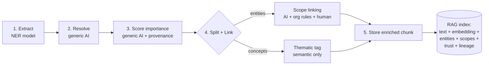

# Phase 6 · Knowledge Module — the NER pipeline (zoom-in)

> **What this is:** the detailed zoom-in on **Phase 6 (Structure & Associate)** of the 7-phase lifecycle in [`02_KNOWLEDGE_ARCHITECTURE.md`](02_KNOWLEDGE_ARCHITECTURE.md). The "5 stages" below are Phase 6's *internal* steps — **not** the whole system pipeline.
> **Audience:** humans orienting to the module *and* coding agents working on any part of it.
> **Status:** settled. Scoring & seeding are now DEFINED in [`04_matrx_quality_model.md`](04_matrx_quality_model.md) (§9 covers what's pipeline-specific). What's left there is *rollout*, not design.
> **Parent / detail docs:** architecture & the 9 STOP rules → [`02_KNOWLEDGE_ARCHITECTURE.md`](02_KNOWLEDGE_ARCHITECTURE.md) · scopes → [`scope-model.md`](scope-model.md) · scopeable entities → [`scopeable_entities.md`](scopeable_entities.md) · trust → [`knowledge_provenance_model.md`](knowledge_provenance_model.md)

---

## 1. What the Knowledge module is

The **Knowledge** module is the single system that turns raw content into knowledge that is **searchable, trustworthy, and associated with the things an org cares about.**

It is one module with four pillars. They are not separate features bolted together — they are four *axes* of the same object:

| Pillar | The question it answers |
|---|---|
| **NER** | *What's in this content?* (extraction) |
| **Scopes** | *What is it about?* (the org's own dimensions) |
| **Trust** | *How much do we believe it, right now?* (provenance + authority) |
| **RAG** | *How do we find it again?* (retrieval infrastructure) |

A single stored chunk carries all four at once: its text + embedding (RAG), its extracted entities/concepts (NER), its scope links (Scopes), and its authority tier + confidence + lineage (Trust).

**The orthogonality rule (memorize this):**
`Scope` = what it's *about* · `Pipeline stage` = where in the *flow* · `Trust` = how much we *believe it* · `RAG` = how we *retrieve it*. These never collapse into each other. Most bugs in this module come from collapsing two of these axes into one. *(System-level view — the four **planes** across the whole lifecycle — is [`02_KNOWLEDGE_ARCHITECTURE.md`](02_KNOWLEDGE_ARCHITECTURE.md) §2; the four **pillars** here are what a single Phase-6 chunk carries.)*

---

## 2. The 5-stage NER pipeline (Phase 6 internals)

Admitted Hub content (the output of Phase 5) flows through these five stages. They are the spine of Phase 6.



| Stage | What happens | Who does it | Cost profile |
|---|---|---|---|
| **1. Extract** | Pull candidate spans (entities *and* concepts) from raw text. | GLiNER2 (cheap, deterministic) or an LLM. | Very low |
| **2. Resolve** | Collapse duplicates and synonyms into unique entities ("Mr. Smith" = "John Smith"; "lumbar strain" = "back injury"). | Generic AI, no special instructions. One batch call over the whole doc's extractions — **not** one call per entity. | Low (1 call/doc) |
| **3. Score importance** | Mark which resolved entities are *distinctive to this doc* vs. corpus noise (firm name, opposing counsel). Provenance weights this. | Generic AI + corpus statistics. | Low |
| **4. Split + Link** | Entities → attempt to link to **scopes** using org rules + structured data (suggestions only, human-confirmed). Concepts → tagged thematic, skip linking. | AI with **org-specific instructions** + human review. | Medium (the only stage that may need custom prompts) |
| **5. Store** | Chunk → embed → persist text + embedding + all metadata (entities, scope links, trust, lineage) together. | Mechanical pipeline. | Embedding cost only |

**Cost north star:** a full document should cost roughly *1 cheap extraction pass + 1–2 small batch LLM calls + embeddings* — not hundreds of calls. If a design implies an LLM call per entity, it is wrong.

---

## 3. Entities vs. Concepts — the split at Stage 4

Stages 1–3 treat both the same. They **diverge at Stage 4.**

- **Entity** = a *named thing with identity* that may map to the org's structured world. "John Smith", "Case 2024-CV-001", "Mercy Hospital". → **eligible for scope linking.**
- **Concept** = a *thematic idea* with no concrete referent. "back pain", "negligence", "informed consent". → **never scope-linked; tagged thematic, used for semantic retrieval and domain context.**

The extractor does not reliably know which is which. Classification into entity-vs-concept is a **downstream decision**, not an assumption baked into Stage 1.

---

## 4. How RAG fits (not just retrieval — the infrastructure)

RAG is the storage-and-search substrate the other three pillars enrich.

**On ingest (Stage 5):** chunk the document (overlapping windows) → embed each chunk → store the chunk text, its vector, the document's resolved entities, importance scores, scope links, authority tier, confidence, content role, and lineage **in the same record.** The metadata *travels with* the chunk. **Each chunk is an artifact node** in the lineage DAG (`04` §22) — it gets its own quality vector and participates in `artifact_lineage_edges`, replacing the legacy single `(source_kind, source_id)` parent pointer.

**On retrieval, two mechanisms run together:**
1. **Semantic search** — vector similarity ("find passages that mean 'severe back injury'"). Catches paraphrase and synonymy.
2. **Structural filter** — restrict by the metadata that rode along ("…but only from documents linked to Client Ava, Case 123, from a `primary`-authority source").

**Plus re-ranking:** a passage carrying several high-importance, scope-linked entities can outrank a marginally-closer passage that is all generic text. Retrieval is semantic **and** structural **and** trust-weighted in one pass.

> The payoff Arman cares about: a random chat, note, or PDF becomes retrievable later by *what it's about* and *whose it is* — e.g. Ava's bio notes surface for "Semester 2 final, Chapter 5" because the document was scope-linked to Ava → her class → the chapter.

---

## 5. Scopes — what Stage 4 links to

> Summary: [`02_KNOWLEDGE_ARCHITECTURE.md`](02_KNOWLEDGE_ARCHITECTURE.md) §4 · full detail: [`scope-model.md`](scope-model.md). Below is only what Stage 4 needs.

The org defines its **own** dimensions. We never hardcode "Customer"/"Case"/"Product" the way Salesforce does.

**Four-level chain:**
```
scope type   →   scope        →   item         →   value
(dimension)      (instance)       (field)          (the data)
e.g. Kids         Ava              age              15
```
**Items are defined on the *type*, not the scope.** Defining `age` on `Kids` gives every kid an `age` cell. Items = columns, scopes = rows, values = cells.

**Two ways something relates to a scope — do not confuse them:**
1. **Attribute of the scope** → an item/value. Ava's `age` *is* Ava.
2. **Entity tagged to the scope** → an M2M assignment. A note/file/task is *about* Ava, not part of her.

Entities tag to a **scope**, never to a scope *type*. One entity → many scopes; one scope → many entities.

**Scope values are ground truth** — curated, authoritative facts, each stamped with `source_type` (`user_input` / `ai_generated` / `imported` / `system`). Values are **versioned**: many rows per cell, the live one is `is_current = true`.

**Tables:** `ctx_scope_types` · `ctx_scopes` · `ctx_context_items` · `ctx_context_item_values` (versioned, `is_current`) · `ctx_scope_assignments` (M2M). Columns: read the DB / `scope-model.md`.

Projects and tasks are a **separate system**, optionally M2M-associated to scopes — not part of the scope hierarchy.

---

## 6. Trust through the pipeline

> **All scoring is canonical in [`04_matrx_quality_model.md`](04_matrx_quality_model.md)** — Quality Vector, log-odds propagation, utility effect types, composite, seeding. The trust **model** — content roles, authority tiers, the `input_authority × utility_transformation` intuition — lives in [`02_KNOWLEDGE_ARCHITECTURE.md`](02_KNOWLEDGE_ARCHITECTURE.md) §5 + [`knowledge_provenance_model.md`](knowledge_provenance_model.md). Below is only what's **specific to this pipeline.**

**Seeding control (anti-sprouting) — governed by `04`.** Derived items (e.g. a flashcard) do **not** auto-become trusted seed sources; seeding requires explicit `seed_policy` / validation / human approval (`can_be_seeded`). Definition in `04`.

**Entity anchoring — an entity is extracted FROM an artifact, it is not one.** Each mention anchors to a single artifact node (`extracted_from_artifact_id`) + `span` + `extraction_confidence` (mechanical) + per-artifact `transformation_flags` + `human_verification`. It does **not** carry a parallel lineage; "also appears in the clean text / raw PDF" is **derived** by walking the artifact lineage DAG, not stored. Resolved entities (stage 2) group mentions across artifacts; trust comes from each anchor's quality vector. Shape canonical in [`04_matrx_quality_model.md`](04_matrx_quality_model.md) §22.

**Trust through the 5 stages:** entities inherit doc tier + confidence (1) → merges keep the highest authority (2) → provenance weights importance (3) → scope links are **suggestions** (`scope_association_suggestions`) until human-confirmed, which writes `ctx_context_item_values` via `set_context_value()` (4) → each chunk stores entities + scope links + authority tier + confidence + content role + lineage beside its embedding (5).

**Retention is the default — we never *auto-drop* content just because we're done reading it; raw stays tagged and gated, re-processable when instructions change.** This is NOT a deletion veto: the **user is the ultimate boss** and may delete anything they own. Deleting an anchor/source triggers a warning + a **tombstone** (node shell + lineage edges + quality vectors kept so derived artifacts don't dangle; bytes purged) — see [`knowledge_provenance_model.md`](knowledge_provenance_model.md) "Deletion & erasure" + [`04`](04_matrx_quality_model.md) §22.7.

---

## 7. Where the work runs — automation / AI / human

| Band | Stages | Mechanism |
|---|---|---|
| **Fully automated, generic AI** | 1–3 | Extraction + dedup + importance. No org-specific prompts. This is where "back pain = lumbar strain" is recognized for free. |
| **AI with org instructions** | 4 (linking) | A *reusable* agent per org with a system prompt: which scope types matter, which entities are noise (e.g. "doctors recurring across patients = noise"), the org's scope/item lists fed in as data. Haiku-class is sufficient — the decision space is narrowed by your rules. |
| **Human in the loop** | 4 (review) | Confirm/correct scope suggestions, resolve flagged ambiguities. Corrections are logged and can refine importance/rules over time. |

A periodic **per-org / per-user theme pass** (human-reviewed) surfaces recurring entities/themes so the user can mark what is noise, what is a meaningful identifier, etc. This is how high-frequency-but-meaningless terms (firm name, carrier names) get damped so low-frequency-but-critical signal ("back pain", a case number) stays visible.

---

## 8. Agent guidance — settled vs. unsettled, and when to STOP

**Settled — build on these. Do not relitigate:**
- The 5-stage pipeline order and the entity/concept split at Stage 4.
- The four-level scope chain and the two relation modes (item/value vs. M2M assignment).
- Scope links are **suggestions until human-confirmed**; confirmation writes values via `set_context_value()`.
- Retention is the **default** (no auto-drop on "done reading"); raw stays tagged & re-processable. **User deletion is absolute** — deleting an anchor warns + tombstones (shell + lineage kept, bytes purged), never a system veto.
- Cost shape: batch passes, not per-entity LLM calls.
- **Personal-org invariant (org-scoping contract).** Every user has exactly one personal organization (`public.organizations.is_personal=true`, materialized by the `create_personal_organization` auth-trigger on signup; verified 70/70 at the time this section landed). **Every row a user writes on `rag.kg_chunks` / `rag.kg_entities` / `rag.kg_chunk_entities` / `rag.kg_edges` MUST carry a non-NULL `organization_id`.** The system NEVER forces a user to pick an org — the default is their personal one, resolved at the ingest boundary by [`aidream/api/utils/effective_org.resolve_effective_organization_id`](../../aidream/api/utils/effective_org.py) via `public.ensure_personal_organization(user_id)`. Three independent gates enforce the invariant: (1) the aidream auto-ingest router that resolves the personal-org default; (2) matrx-rag refusing to persist a NULL org on `ingest_source` / `extract_entities`; (3) [`scripts/validate_org_scoping.py`](../../scripts/validate_org_scoping.py) — a loud-but-non-blocking release-time drift check wired into `release.sh`. The visibility predicate in [`aidream/api/routers/kg_graph.py`](../../aidream/api/routers/kg_graph.py) fails closed for any row that ever appears with a NULL org. Background: the 2026-06-03 incident, where the "NULL org ⇒ globally visible" branch silently leaked 350+ personal-scope entities to every other user.

**⚠️ The 9 STOP rules apply in full to this module.** They are kept as a single canonical list in [`02_KNOWLEDGE_ARCHITECTURE.md`](02_KNOWLEDGE_ARCHITECTURE.md) §7 (one copy, so they can't drift). The two that bite most often here: **never** explain/compute scoring outside [`04_matrx_quality_model.md`](04_matrx_quality_model.md), and **never** conflate the three score types — Quality (`04`) vs scope match confidence vs *extraction confidence* (mechanical, not trust).

**When planning new code, look here first:**
- Extraction/resolution/importance → §2, §3.
- Anything touching scopes → §5 + `scope-model.md` + the `ctx_*` tables.
- Anything touching scoring/quality/trust/authority → [`04_matrx_quality_model.md`](04_matrx_quality_model.md) (canonical) + §6 + `knowledge_provenance_model.md`.
- Retrieval/indexing → §4.

---

## 9. Scoring & seeding — DEFINED in `04` (rollout pending)

Quality scoring and seeding control are **decided**, in [`04_matrx_quality_model.md`](04_matrx_quality_model.md) — the single source of truth. This module **refers to `04`**; it does not re-explain scoring.

### 9a · Quality / trust scoring — DECIDED
Not one number: a **Quality Vector** (`source_quality`, `capture_quality`, `faithfulness`, `alignment`, `coverage`, `utility_value`) + purpose-dependent **`composite_quality`**, propagated in log-odds space via the `preserve` / `additive_impact` / `targeted_transform` effect types. See `04`.

**Pipeline-specific note:** the per-mention `confidence` → per-entity `confidence_avg` stored today is **NER extraction confidence** — a mechanical capture signal, *not* the quality composite and *not* trust. It feeds `04` only as a capture-side gate, never as the composite. Keep the three score types separate: Quality (`04`) · scope match confidence ([`scope-association-pipeline.md`](scope-association-pipeline.md)) · extraction confidence.

### 9b · Seeding control (anti-sprouting) — GOVERNED by `04`
Hard rule: derived artifacts do **not** automatically become trusted seed sources. Seeding requires explicit `seed_policy` / validation / human approval (`can_be_seeded`). Definition + fields in `04`.

### What's actually still open here
*Rollout*, not design: wiring the quality engine into ingest/Stage-5 persistence, the DB columns, and default utility profiles for this pipeline's utilities (chunker, extractor, resolver). Tracked in [`00_MASTER_TASKLIST.md`](00_MASTER_TASKLIST.md).
