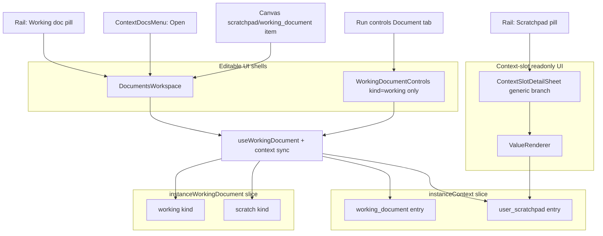

# Scratchpad / working-document surface duplication — fact finding

**Date:** 2026-07-05  
**Scope:** Why scratchpad (and partially working-document) behaves differently depending on where the user opens it from in chat/canvas.  
**Constraint:** Facts only — no proposed fixes.

---

## Summary

The codebase does **not** track documents by title. Documents are keyed in Redux by `(conversationId, kind)` and in the database by document `id`.

What *does* exist are **two parallel representations** of the same conversation documents, plus **multiple UI shells** that consume those representations differently:

1. **`instanceWorkingDocument` slice** — canonical editor state (content, title, binding, enabled, materialized, version). All editable surfaces read/write here via `useWorkingDocument`.
2. **`instanceContext` slice** — agent-facing publication (`working_document` and `user_scratchpad` context entries). Built by `useWorkingDocumentContextSync` from the same hook; intended for what the agent sees on the next turn, not for human editing UI.

Additionally, **`ContextSlotDetailSheet`** treats `working_document` and `user_scratchpad` differently: working document gets routed to the live editor workspace; scratchpad stays on the context-slot readonly detail path.

---

## Canonical data model (facts)

| Layer | Location | Key | Holds |
|---|---|---|---|
| Editor state | `features/agents/redux/execution-system/instance-working-document/instance-working-document.slice.ts` | `workingDocKey(conversationId, kind)` — `"working"` uses bare `conversationId`; `"scratch"` uses `` `${conversationId}::scratch` `` | `content`, `title`, `binding`, `enabled`, `materialized`, `version`, … |
| Agent context publication | `features/agents/redux/execution-system/instance-context/` | Context entry keys `working_document`, `user_scratchpad` | Rich dict values from `buildWorkingDocumentContextValue` / `buildUserScratchpadContextValue` in `features/agents/utils/workingDocumentContext.ts` |
| Durable rows | `workbench.working_documents` + `platform.associations` edges | Document UUID (`reservedWorkingDocumentId` or linked id) | Persisted title/content; M2M to conversations |

Context keys (constants in `workingDocumentContext.ts`):

- `WORKING_DOCUMENT_CONTEXT_KEY` = `"working_document"`
- `USER_SCRATCHPAD_CONTEXT_KEY` = `"user_scratchpad"`

---

## Shared editor primitives (facts)

These are reused across several surfaces:

| Primitive | File | Role |
|---|---|---|
| `useWorkingDocument` | `features/agents/hooks/useWorkingDocument.ts` | Single hook for draft, persist, enable/disable, title, canvas open, conflict handling |
| `useWorkingDocumentContextSync` | same file | Publishes/removes `instanceContext` entries; shared Supabase realtime subscription per document id |
| `useConversationDocumentsBridge` | same file | Hydrates persisted docs on mount + runs context sync for **both** kinds; mounted from `RunControlsMenu` |
| `WorkingDocumentPanel` | `features/agents/components/working-document/WorkingDocumentPanel.tsx` | Editor chrome + `WorkingDocumentEditor` |
| `WorkingDocumentEditor` | `features/agents/components/working-document/WorkingDocumentEditor.tsx` | Actual markdown editor |
| `DocumentsWorkspace` | `features/agents/components/working-document/documents-workspace/DocumentsWorkspace.tsx` | Tab strip (Working + Scratch base tabs) + optional docs rail; each tab mounts `WorkingDocumentPanel` |
| `WorkingDocumentControls` | `features/agents/components/working-document/WorkingDocumentControls.tsx` | Compact control row + embedded `WorkingDocumentPanel`; **`kind` prop defaults to `"working"` only** |

There is **no** `ScratchpadBody`, **no** `user_scratchpad` entry in `features/agents/components/context-items/registry.tsx`, and **no** scratch-specific branch in `ContextSlotDetailSheet` comparable to working document.

---

## Context / detail UI primitives (facts)

| Primitive | File | Role |
|---|---|---|
| `ConversationContextRail` | `features/agents/components/inputs/smart-input/ConversationContextRail.tsx` | Pills above composer; opens detail surfaces on click |
| `ContextSlotDetailSheet` | `features/agents/components/context-slots-display/ContextSlotDetailSheet.tsx` | Right-side panel for a single context entry |
| `ContextItemDrawer` | `features/agents/components/context-items/ContextItemDrawer.tsx` | Registry-driven drawer for attachment chips (notes, tasks, media, …) |
| `WorkingDocumentBody` | `features/agents/components/context-items/bodies/WorkingDocumentBody.tsx` | Adapter that renders `DocumentsWorkspace` (not a separate editor fork) |
| `ValueRenderer` | inside `ContextSlotDetailSheet.tsx` | Readonly context-slot detail: markdown, links, JSON pretty-print, known ambient keys |

---

## Branching fact: `ContextSlotDetailSheet` treats keys unequally

File: `features/agents/components/context-slots-display/ContextSlotDetailSheet.tsx`

```ts
const isWorkingDocument = contextKey === WORKING_DOCUMENT_CONTEXT_KEY;
```

- When `isWorkingDocument === true`: body renders `WorkingDocumentBody` → `DocumentsWorkspace` (live editor path, reads `instanceWorkingDocument`).
- **All other keys** (including `user_scratchpad`): body renders context-slot sections (`Description`, `Value`, `Inline policy`, `Ad-hoc key`, …) and `ValueRenderer` over `displayValue` resolved from `instanceContext` / snapshot — **not** `DocumentsWorkspace`.

`ConversationContextRail` opens scratchpad via:

```ts
onOpen: () => openEntry(scratch)  // → ContextSlotDetailSheet with contextKey = USER_SCRATCHPAD_CONTEXT_KEY
```

Working document pill uses the same sheet but hits the `isWorkingDocument` branch.

---

## Surface inventory — where each entry point lands

### A. Editable path (`DocumentsWorkspace` → `WorkingDocumentPanel` → `useWorkingDocument` → `instanceWorkingDocument`)

| # | User entry | Mount chain | Scratch tab? | State read |
|---|---|---|---|---|
| A1 | Canvas item type `scratchpad` or `working_document` | `CanvasBody` → `DocumentsWorkspace` | Yes (base tabs) | `instanceWorkingDocument` |
| A2 | Context docs menu → **Open** on scratch/working row | `useOpenWorkingDocumentPanel` → `OverlayController` `workingDocumentPanel` → `DocumentsWorkspace` with `initialKind` | Yes | same slice |
| A3 | Floating window `workingDocumentWindow` | `WorkingDocumentWindow` → `DocumentsWorkspace` | Yes | same slice |
| A4 | Context rail → **Working doc** pill | `ContextSlotDetailSheet` → `WorkingDocumentBody` → `DocumentsWorkspace` | Yes | same slice |
| A5 | `DocumentsWorkspace` tab strip → Scratchpad tab | In-place tab switch inside A1–A4 | Yes | same slice (`kind: "scratch"`) |

Canvas open payload (from `useWorkingDocument.openInCanvas`):

```ts
canvas.open({
  type: kind === "scratch" ? "scratchpad" : "working_document",
  data: { conversationId, kind },
  metadata: { sourceMessageId: `wd:${conversationId}:${kind}`, … },
});
```

Canvas body pointer (`CanvasBody.tsx`): `data.conversationId` + `initialKind` — **does not embed content in canvas Redux**; reads live slice + DB.

### B. Editable path but **working kind only** (no `DocumentsWorkspace` tab strip)

| # | User entry | Mount chain | Scratch? | State read |
|---|---|---|---|---|
| B1 | Run controls → **Document** tab | `RunControlsTabPanel` → `WorkingDocumentControls` (`kind` default `"working"`) → `WorkingDocumentPanel` | **No scratch tab** — single embedded panel | `instanceWorkingDocument` for working kind only |

`useConversationDocumentsBridge` is mounted on **`RunControlsMenu`** (always-on trigger in input toolbar), not on canvas or `ContextSlotDetailSheet`. Hydration + both-kind context sync are owned there; other surfaces **read** the slice once populated.

### C. Readonly / context-slot path (`instanceContext` display, not editor)

| # | User entry | Mount chain | Editable? | State read |
|---|---|---|---|---|
| C1 | Context rail → **Scratchpad** pill | `ContextSlotDetailSheet` → `ValueRenderer` + slot metadata sections | **No** — context-item chrome | `instanceContext` entry value (`buildUserScratchpadContextValue` shape: `{ content, mutable: false, persist: "client", label, description, … }`) |
| C2 | Context rail → other live context entries | Same sheet, generic branch | No | `instanceContext` |
| C3 | Context rail → context layers | `ContextItemDrawer` | No (layer bodies) | Scope/app context |

For C1, `ValueRenderer` does **not** mount `useWorkingDocument`. If the value is a rich object (not a plain string), it falls through to JSON pretty-print of the whole context value object.

`user_scratchpad` is **not** registered in `KNOWN_CONTEXT_VALUES` (`knownContextValues.tsx`) — no specialized human-readable renderer.

---

## Input-area layout — two different affordances for documents

Both live in the Smart Input shell:

| Affordance | Component | Working doc click | Scratch click |
|---|---|---|---|
| **Context rail** (labeled "Context", pills above textarea) | `ConversationContextRail` | `ContextSlotDetailSheet` → editor workspace (A4) | `ContextSlotDetailSheet` → readonly context slot UI (C1) |
| **Documents & context menu** (Layers icon in toolbar) | `ContextDocsMenu` | Toggle enable + **Open** → `workingDocumentPanel` overlay (A2) | Same, with `initialKind: "scratch"` |

Mounted from:

- `ConversationContextRail`: `SmartAgentInputStacked`, `SmartAgentInputSingleRow`
- `ContextDocsMenu`: `InputActionButtons`

These are **different code paths** for the same underlying document kinds.

---

## Agent context publication vs editor (facts)

`useWorkingDocumentContextSync` (inside every `useWorkingDocument` mount):

- When `enabled`: dispatches `setContextEntries` with the rich value immediately on every content change (no debounce).
- When disabled: dispatches `removeContextEntry`.
- Working kind → key `working_document`, `mutable: true`, `persist: "auto"`.
- Scratch kind → key `user_scratchpad`, `mutable: false`, `persist: "client"`, no writeback `source`.

The rail's scratch pill visibility uses `selectInstanceContextEntries` + `entryHasValue`. A enabled scratchpad with an empty `content` string still produces a rich object with multiple keys, so the object passes `entryHasValue` even when `content` is `""`.

---

## Registry / drawer system (facts)

`features/agents/components/context-items/registry.tsx`:

- Registers `working_document` block type → `WorkingDocumentBody` (`editable: true`).
- Does **not** register `user_scratchpad` or any scratch block type.
- `input_document` (reference by id) is separate, readonly `GenericBody`.

`ContextItemDrawer` is used by attachment chips (`SmartAgentResourceChips`, `AgentUserMessage`) and context-layer rail items — **not** by the scratchpad pill in `ConversationContextRail`.

---

## Run-controls document tab vs workspace (facts)

`RunControlsTabPanel` document tab:

```tsx
<WorkingDocumentControls conversationId={conversationId} />
```

- No `DocumentsWorkspace`.
- No scratch/working tab strip.
- `WorkingDocumentControls` accepts optional `kind`; tab panel never passes `kind="scratch"`.
- Badge dot on Document tab uses `selectWorkingDocEnabled(conversationId)` which defaults to **`"working"` kind only** — scratch enabled state does not affect that dot.

---

## Documentation drift (facts — code vs written docs)

Several docs describe a unified editable experience that the code only applies selectively:

| Doc claim | Code reality (2026-07-05) |
|---|---|
| `ConversationContextRail` comment: scratch "opens the private doc" via same openers as working doc | Scratch opens `ContextSlotDetailSheet` generic branch, not `WorkingDocumentBody` |
| `features/agents/components/chat/FEATURE.md` (2026-06-22): rail opens `ContextSlotDetailSheet` → editable `WorkingDocumentPanel` for working doc | Working doc opens `WorkingDocumentBody` → `DocumentsWorkspace` (tabs), not bare `WorkingDocumentPanel` |
| `features/agents/components/context-items/FEATURE.md` Working document section: drawer mounts full `NoteEditorCore` modes via `WorkingDocumentEditor` | `WorkingDocumentBody` mounts `DocumentsWorkspace` only; editor details live under `WorkingDocumentPanel` / `WorkingDocumentEditor` inside that tree |
| `features/agents/FEATURE.md` "One UI component" — `WorkingDocumentPanel` everywhere | `DocumentsWorkspace` is an additional composition shell used in canvas, sidebar overlay, window, and working-doc context body; run-controls uses `WorkingDocumentControls` without workspace tabs |

---

## User-reported behaviors mapped to code paths

| Reported behavior | Matching code path |
|---|---|
| Enable scratch, click scratch from **input context rail** → readonly context-item UI | C1: `ContextSlotDetailSheet` non-`working_document` branch |
| Open **canvas**, activate scratchpad, type → saves | A1 + A5: `DocumentsWorkspace` / `useWorkingDocument` persist to `instanceWorkingDocument` + DB |
| In **chat**, click scratchpad (context rail) → empty / readonly / context chrome | C1: displays `instanceContext` rich dict via `ValueRenderer`, not editor slice UI; may show JSON/metadata rather than an editor; `content` field may be empty if nothing typed yet in that session |
| In **working document workspace** (sidebar/canvas/window tabs), click Scratchpad tab → edit + persist | A5: same `instanceWorkingDocument` slice, `kind: "scratch"` |
| Working doc from rail → editable | A4: special-case in `ContextSlotDetailSheet` |

---

## File reference index

| Concern | Primary files |
|---|---|
| Context rail assembly | `features/agents/components/inputs/smart-input/ConversationContextRail.tsx` |
| Docs menu Open button | `features/agents/components/inputs/smart-input/ContextDocsMenu.tsx` |
| Sheet branching | `features/agents/components/context-slots-display/ContextSlotDetailSheet.tsx` |
| Editor workspace | `features/agents/components/working-document/documents-workspace/DocumentsWorkspace.tsx` |
| Sidebar overlay | `features/overlays/OverlayController.tsx` (`workingDocumentPanel` block), `features/overlays/openers/workingDocumentPanel.tsx` |
| Canvas embedding | `features/canvas/core/CanvasBody.tsx` |
| Run controls document tab | `features/agents/components/inputs/smart-input/RunControlsTabPanel.tsx` |
| State + sync hook | `features/agents/hooks/useWorkingDocument.ts` |
| Context value builders | `features/agents/utils/workingDocumentContext.ts` |
| Hydration owner | `features/agents/components/inputs/smart-input/RunControlsMenu.tsx` (`useConversationDocumentsBridge`) |

---

## Structural diagram (relationships, not a fix proposal)



---

*End of fact finding. No recommendations included by request.*
