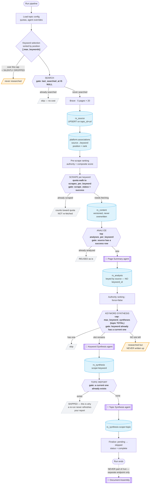
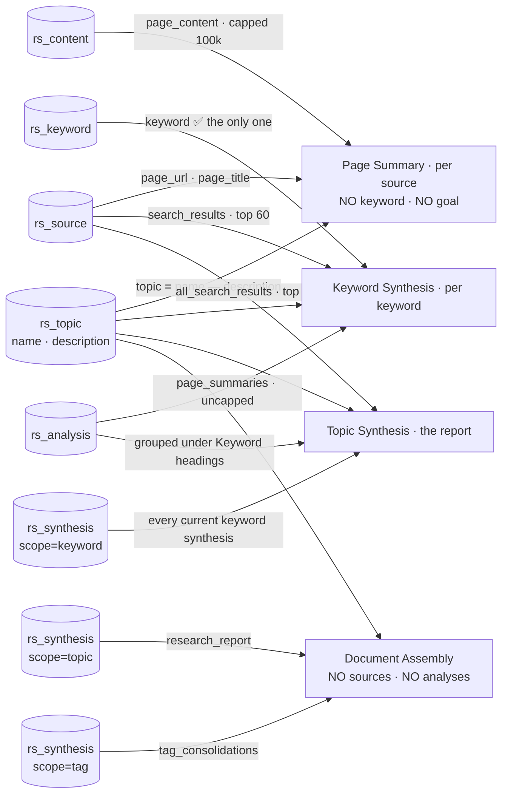

# Research Pipeline — Flow and Agent Inputs

**Purpose:** the two questions you cannot answer from the code without an hour of
reading — *what actually runs when I press Run?* and *what exactly does each AI
agent receive?* Everything here is traced from the aidream source with
`file:line` citations, not from intent docs.

Read this before changing any prompt, adding a pipeline stage, or deciding what
context an agent should get.

---

## 1. What runs when you press "Run pipeline"

`POST /research/topics/{id}/run` → `run_initial_pass` (aidream
`research/service.py:1536`). Every stage has a **skip gate**; the whole design is
"reuse everything already captured." The gates are what make a re-run cheap.

**The three amber boxes are the traps**, all now surfaced in the UI (2026-07-25):
keywords past `max_keywords` never run; keywords past the topic-wide
`max_keyword_syntheses` total get researched but never written up; and the topic
report is *never* refreshed by a re-run once one exists.

---

## 2. What each agent actually receives

This is the map that matters for any prompt or context change. **The keyword
string reaches an LLM in exactly one place.**

### Every agent, and what it gets

| Agent | Receives | Keyword? |
|---|---|---|
| **Page Summary** (per source) | `topic`, `page_content` (100k cap, head 80% + tail 20%), `page_url`, `page_title` | no |
| **Keyword Synthesis** | `topic`, **`keyword`**, `search_results` (top 60, snippet-relevance ≥ 25), `page_summaries` (uncapped) | **yes — only here** |
| **Topic Synthesis** | `topic`, `all_search_results` (top 100), `all_page_summaries` grouped under `## Keyword:` headings, every current keyword synthesis | headings only |
| **Document Assembly** | `topic`, `research_report`, `tag_consolidations` — never a source or an analysis | no |
| **Tag Consolidation** | `topic`, `tag_name`, **full raw page bodies** of every tagged source + their summaries — no truncation | no |
| **Auto-tagger** (per source) | `topic`, full `page_content` (untruncated), the topic's tag list | no |
| **Authority Ranker** | `topic` + JSON batch of ≤25 sources; search rank deliberately withheld | no |
| **Topic Suggest** | **one field**: `subject_name_or_description` → title, description, `suggested_keywords` | invents them |

`topic` everywhere is `get_topic_context()` = `f"{name} — {description}"` — no keywords, no tags, no truncation (`research/service.py:2199`).

Source scoring (pre-read and post-read) is **pure heuristic**, not an LLM call
(`research/source_scoring.py`, `research/page_analysis.py:187`).

### Agent overrides

Eight role keys on `rs_topic.agent_config`, resolved
`explicit arg → agent_config → user preference → pinned default`
(`research/agent_resolution.py:67`): `page_summary`, `suggest`,
`keyword_synthesis`, `research_report`, `updater`, `consolidation`,
`auto_tagger`, `document_assembly` (each `*_agent_id`). The Authority Ranker and
the Cross-Cutting Tag Generator are floating and **not overridable at all**.

### The structural consequence

A source shared by four keywords gets **exactly one** Page Summary, written as if
the topic subject were the only lens. When you later add a keyword aimed at one
partner of a firm, the pipeline correctly *reuses* those summaries — but they
were never looking for that person. The keyword synthesis then has to extract a
partner-specific answer from page summaries written about the firm.

That is the ceiling on incremental research quality, and it is structural:
`research.rs_analysis` has no `keyword_id`, and `analyze_source`
(`research/analysis.py:163`) takes no keyword parameter.

### Rough edges found while tracing (not yet fixed)

- **Tag consolidation has no truncation** (`research/tagging.py:56-96`) — it sends
  the FULL body of every tagged source. Page Summary caps at 100k; this doesn't
  cap at all. A big tag can blow context and cost.
- **Auto-tagger is uncapped too** (`research/tagging.py:226`) — only logs a
  warning above 100k chars.
- **Keyword *update* mode drops the keyword** (`research/synthesis.py:249`) — the
  Updater agent gets `previous_report` + `new_information` only; neither the
  keyword string nor the search results are passed.
- **Topic update computes `all_search_text` and never uses it**
  (`research/synthesis.py:558`) — dead work on every report update.
- **Override precedence is inverted in one place** — `_synthesize_topic_update`
  (`research/synthesis.py:596`) orders `agent_config → explicit arg`, the reverse
  of every other call site.

## 3. Where a change would land

| If you want to change… | Touch | Ripples into |
|---|---|---|
| What a page is read *for* | `PageSummaryInputs` + `analyze_source` + `rs_analysis` dedup key | analysis reuse, cost, the analyze selector |
| What a keyword *means* | `rs_keyword` (a goal column), topic creation, keyword add UI | AI topic-suggest, both synthesis prompts |
| What the report is built from | `topic_synthesis` inputs | report prompt, `max_topic_syntheses` semantics |
| Adding a new source kind (video, X) | search surface + source adapter registries | `rs_source.source_type`, scraper dispatch, `rs_content.capture_method` |

---

## Change log

- `2026-07-26` — Created. Traced against aidream `research/` (service, search,
  scraper, analysis, synthesis, document) to document the real skip gates and
  the exact agent input contracts, ahead of the per-keyword-goal work.
