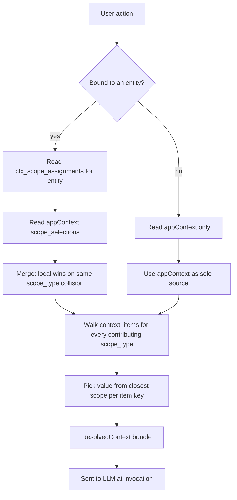

# FEATURE.md — `scopes`

**Status:** `scaffolded` — module being built ground-up to replace the sprawling scope/context layer across `features/agent-context/` and `features/scope-system/`. Code lands in phases; this doc is the canonical model from day one.
**Tier:** `1` — foundational for every agent invocation and every feature that filters, tags, or resolves by user-defined dimensions.
**Last updated:** `2026-05-16`

> This doc is the single source of truth for **scopes**. If something contradicts it (an existing slice, an old hook, a stale README), the doc wins and the code is wrong. Read this end-to-end before touching anything in `features/scopes/`, `features/agent-context/`, `features/scope-system/`, `app/(authenticated)/scopes/`, or any consumer that picks/tags/filters by scope.

---

## Purpose

A first-class home for **scope** — the user-authored dimensions inside an organization (Client, Department, Repo, Case, Patient, etc.). One module owns the tree, the values, the templates, the active picker, the entity tagger, and the resolution into the final context bundle the LLM receives.

---

## The conceptual model — context vs scope

These two words sound interchangeable. They are not. Confusing them is what produced the eight-slice sprawl this module replaces.

### Context

Everything the LLM needs to do its job for the current request. Assembled by the system at invocation time. Users never edit "context" directly as a thing.

Sources that flow into context, roughly in order of importance:

1. **Scopes** — highest signal. Each active scope contributes ~N field values (the "50 datapoints per Client" pattern).
2. **Organization** — the umbrella that owns the scope types.
3. **Project / Task** — the work spine. Useful but lower signal than scope.
4. **User** — preferences, role, identity.
5. **Ambient** — selection, open file, conversation history, cached recents.

### Scope

The user-defined dimensions inside an org. Each scope type is a dimension (`Client`, `Department`); each scope is a value on that dimension (`Dr. Nazarian`, `Rejuvina Medspa`, `SEO`, `Content Writing`). Each scope holds context items (the columns) and context item values (the cells).

Scope is the most important *part* of context, not its synonym. Why important? Because it is the only piece of context users **author by hand** — the org admin decides which dimensions matter, then fills the cells once, and that work feeds every downstream invocation forever.

### Why the distinction matters — the Liquid Facelift example

> User asks: "Can you help me come up with some good keywords for *Liquid Facelift*?"

**Run 1 — context bundle:**

- User: Joe Smith, SEO Content Writer
- Org: XYZ Marketing, Inc.
- Scopes:
  - Department: Content Writing
  - Client: Dr. Nazarian Plastic Surgery

The agent's response is a content writer's brief on Liquid Facelift, framed as a great alternative to plastic surgery, comparing both fairly so people pick what's best for them. No SEO-technical jargon.

**Run 2 — change only the scopes:**

- User: Joe Smith, SEO Content Writer
- Org: XYZ Marketing, Inc.
- Scopes:
  - Department: SEO
  - Client: Rejuvina Medspa

Without the user touching any prompt, the response transforms:

- The user is now an SEO expert — give technical guidance, not fluff.
- The client is a medspa, not a plastic surgeon — push non-surgical alternatives, downplay surgery options.
- Keywords should push readers away from surgery toward non-surgical procedures.

Two completely different LLM outputs from two scope changes. **The scope didn't change what the user asked — it changed what "good" means for this request.** That's the entire reason this module exists.

### Templates

Templates are just "quick start" — a bundle of `scope_types + context_items` for a known industry. Applying a template to an org bootstraps the dimensions and the columns, then the user fills in the cells. Templates are read-only catalog data, not part of any active context.

---

## Global vs local context — the load-bearing invariant

This is the #1 invariant. Misunderstanding it is what made the old code rot.

### Global context

What the user is working on *right now*. Lives in `appContextSlice`. Used by anything not tied to a specific entity (the sidebar, the chat composer at the top level, "create a new note" without a parent, "run this agent" from the home screen).

```
appContextSlice = {
  organization_id,
  scope_selections: Record<scope_type_id, scope_id>,   // exactly one scope per type
  project_id,
  task_id,
  conversation_id,
}
```

### Local context

The context attached to a specific entity (a note, a task, an agent, an attachment, anything). Stored via `ctx_scope_assignments` (M2M) plus the entity's own FK columns (`project_id`, `task_id`, `organization_id`).

### The invariant

> **Global context is ONLY written by things that explicitly modify global context.**

A picker that says "tag this note with Client: Rejuvina" writes to `ctx_scope_assignments`. Period. It never dispatches `setOrganization` / `setActiveScope` / anything that touches `appContextSlice`.

This rule kills the #1 bug in the old code: every helpful picker silently mutated the sidebar. Opening a note to tag it with a scope quietly redirected the entire app's active context. That stops here.

### Resolution rule — closest-to-action wins

Locally-triggered actions read local-first, with global as optional fallback:

1. Action fired from inside a note context-menu → resolver consults the note's tagged scopes first.
2. For any context item key not provided by local scopes → fall back to the global active scopes.
3. For non-collision dimensions → take the union (global Department + local Client both apply).

Globally-triggered actions (the chat composer at the app level, the home agent runner, anything not entity-bound) read global only.

### Concrete example

- Global active: `Client: Dr. Nazarian`, `Department: Content Writing`
- Note open. Note tagged with: `Client: Rejuvina`
- User runs a context-menu agent on a selection in the note ("clean up transcription").

The agent receives:

- `Client: Rejuvina` (local wins on collision)
- `Department: Content Writing` (no local override, global flows through)
- All context-item values for `Rejuvina`, then any `Content Writing` values not provided by Rejuvina.

Result: the transcription uses Rejuvina's custom dictionary. If the audio mentions "Dr. Nazarian," the agent might misspell it — and **that's acceptable**, because transcription is single-scope by nature. The user wanted Rejuvina's dictionary; they got it. If they want multi-scope dictionaries, that's a feature they can build.

---

## Contradiction warnings — never blocks, only informs

A "contradiction" is **two scopes of the same scope type active simultaneously** between global and local. That's it. Different dimensions are not contradictions.

| Situation | Status |
|---|---|
| Global: `Client: Dr. Nazarian`. Local: `Department: SEO`. | Not a contradiction — different scope types. Both apply. |
| Global: `Client: Dr. Nazarian` + `Department: Content Writing`. Local note tagged `Client: Rejuvina`. | **Contradiction on `Client`.** Show notice. |
| Global: `Client: Dr. Nazarian`. Local task tagged `Client: Dr. Nazarian` + `Department: SEO`. | Not a contradiction — same Client, plus a new dimension. |

### UX

- Render a small notice at the top of the **local view** when the user opens an entity whose tagged scopes contradict the current global active scopes on any scope type.
- Notice copy: "This [note/task/agent] is scoped to *Rejuvina Medspa*, but your active context has *Dr. Nazarian*. Locally-triggered actions will use *Rejuvina*. Globally-triggered actions still use *Dr. Nazarian*."
- Never block. Multi-scope-aware agents handle it; single-scope agents will produce worse output — informing the user is enough.
- The notice lives where the user is acting from (inside the entity view). The global sidebar doesn't show contradictions because globally-scoped actions are not affected.

### Why this is the right rule

95% of agents are built scoped to one thing — they'll behave unexpectedly under contradiction. But 5% are built to handle multi-scope (joint articles, comparison analyses, cross-org research). Hard-blocking would break the 5% and force them to either churn the global context or work around the system. Warning informs without restricting.

---

## Multi-scope picker rules

Both pickers (global and local) follow the same selection grammar.

| Axis | Cardinality |
|---|---|
| Organization | 1 (implied by the scopes' owning org) |
| Scope per scope_type | exactly 1 (within-type collision is invalid because context-item values would collide) |
| Number of scope_types active | 0..N (across-type is fully additive) |
| Project | 0..1 |
| Task | 0..1 |

Adding a scope of type `T` when type `T` already has an active scope **replaces** the previous selection. Cascade-replace; no confirm.

Clicking the same active scope again **deactivates** it.

Across types: clicking is purely additive. Adding `Client: X` does not touch `Department`, `Repo`, or any other type.

Cross-org: picking a scope from a different org snaps the active org to that scope's org (it has to — scopes live in exactly one org). The sidebar updates; consumers re-resolve.

---

## Orphan handling — empty ≠ not-fetched

Some projects have no scope association. Some tasks have no project or scope. They are first-class, not bugs. Users expect them in the tree.

### UI rule

Every level of the tree shows an **"Other"** bucket at the bottom:

- Under an org: "Other projects" (projects in this org with no scope association).
- Under a scope or project: "Other tasks" (tasks with no parent scope/project).

### State machine

Each "Other" bucket carries its own load state, distinct from the tree's overall state:

```ts
type OrphanBucketStatus =
  | 'unfetched'  // user has not asked yet; render "Load others"
  | 'loading'    // fetch in flight
  | 'ready'      // populated; render the list
  | 'empty'      // fetched, none exist; render "No others"
  | 'error';     // fetch failed; render retry
```

`unfetched` and `empty` are different states with different UI. Showing "No others" before the user has asked is a lie.

### Why lazy

Orphan fetches are skipped at boot because they're chatty and not needed for first paint. The user clicks "Load others" → fetch fires → state transitions through `loading` → `ready`/`empty`.

---

## Fetching invariants

Read these out loud before adding any thunk.

1. **One root tree fetch at boot.** RPC: `get_user_scope_tree_with_projects`. Returns orgs → scope_types → scopes → projects. Bundled because every Surface A render needs projects.
2. **Tasks are never in the root fetch.** Too chatty. Tasks are loaded per-level on user selection (`list_scope_tasks(level, id)`), cached by `{level}:{id}`.
3. **No refetching ever, except on an explicit user refresh click.** A thunk fired twice from a render cycle or a route change is a bug, not a feature.
4. **Boot fetch is deferred and low-priority.** It runs after critical UI is painted. The tree is needed for sidebar interactivity, not initial render.
5. **Cache invalidation is mutation-driven.** Successful mutations patch the tree in place. No "stale time" magic.
6. **Empty ≠ not-fetched.** State must distinguish. Selectors return `unfetched` distinct from `empty`.
7. **In-flight dedup.** A thunk that finds a `loading` state in its target slot returns the in-flight promise instead of starting a second one.
8. **Single chokepoint.** All Supabase calls for `ctx_*` tables go through `features/scopes/service/scopesService.ts`. Enforced by ESLint rule.

---

## The resolution algorithm

Pseudocode for "given the entity I'm acting on and the global context, what's the final context bundle?"

```ts
function resolveContext(opts: {
  entityType?: 'note' | 'task' | 'agent' | ...;
  entityId?: string;
  activeContext: AppContext;
  userId: string;
}): ResolvedContext {
  const sources: ScopeContribution[] = [];

  // 1. Local scopes (closest to action, win on collision)
  if (opts.entityType && opts.entityId) {
    const localScopeIds = getEntityScopes(opts.entityType, opts.entityId);
    for (const scopeId of localScopeIds) {
      sources.push({ scope: scopeId, origin: 'local', priority: 1 });
    }
  }

  // 2. Global active scopes (fallback for keys not provided locally)
  for (const [typeId, scopeId] of Object.entries(opts.activeContext.scope_selections)) {
    sources.push({ scope: scopeId, origin: 'global', priority: 2 });
  }

  // 3. Project / Task FK contributions
  if (opts.activeContext.project_id) {
    sources.push({ project: opts.activeContext.project_id, origin: 'global', priority: 3 });
  }
  if (opts.activeContext.task_id) {
    sources.push({ task: opts.activeContext.task_id, origin: 'global', priority: 4 });
  }

  // 4. Resolve: walk every context item key declared on every contributing scope type,
  //    pick the lowest-priority (= closest) source that provides a value.
  const merged: Record<string, ItemValue> = {};
  const sourcePerKey: Record<string, ContextSource> = {};
  for (const source of sources.sort(byPriority)) {
    for (const item of getContextItems(source)) {
      if (merged[item.key] === undefined) {
        merged[item.key] = item.value;
        sourcePerKey[item.key] = source;
      }
    }
  }

  // 5. Detect contradictions: scope types with both a local and a global selection
  //    on different scope ids.
  const contradictions = detectContradictions(sources);

  return {
    values: merged,
    sourcePerKey,
    contradictions,
    activeScopes: sources.filter(s => s.scope),
    organizationId: opts.activeContext.organization_id,
    userId: opts.userId,
  };
}
```

Server-side equivalents live as RPCs: `resolve_active_context()` (no entity — globally-triggered actions) and `resolve_local_context()` (with entity — locally-triggered actions). See `features/scopes/docs/RPC_CONTRACTS.md`.

---

## Data model

### Tables

All `ctx_*` tables. Owned by this module; only `scopesService.ts` may query them.

| Table | Role |
|---|---|
| `ctx_scope_types` | Dimensions defined inside an org (Client, Department, Repo). `organization_id`, `label_singular`, `label_plural`, `icon`, `color`, `max_assignments_per_entity`, `default_variable_keys`, `parent_type_id` (for nesting). |
| `ctx_scopes` | Values on a dimension (Dr. Nazarian, Rejuvina). `scope_type_id`, `organization_id`, `name`, `description`, `parent_scope_id` (for nesting), `settings`. |
| `ctx_context_items` | The "columns" — fields defined on a scope type. `scope_type_id`, `key`, `display_name`, `value_type`, `fetch_hint`, `sensitivity`, `category`, `depends_on`, `is_active`. |
| `ctx_context_item_values` | The "cells" — values per scope instance. `context_item_id`, `scope_id`, `is_current`, `version`, one of `value_text` / `value_number` / `value_boolean` / `value_json` / `value_document_url` / `value_reference_id`, plus audit fields. |
| `ctx_scope_assignments` | M2M tags from a scope to any entity. `entity_type`, `entity_id`, `scope_id`. The local-context join table. |
| `ctx_context_access_log` | Append-only fetch audit. `context_item_id`, `value_id`, `accessed_at`, `was_useful`. Powers usage analytics. |
| `ctx_templates` | Read-only quick-start catalog. `key`, `name`, `category`, `icon`, `is_active`, `sort_order`. |
| `ctx_template_scope_types` | Scope types defined by a template. `template_id`, `label_singular`, `label_plural`, etc. |
| `ctx_template_context_items` | Context items defined by a template. `template_scope_type_id`, `key`, `display_name`, `value_type`, etc. |

### Containment

```
organizations
  └─ ctx_scope_types         (dimensions defined per org)
       └─ ctx_scopes         (values on a dimension; can nest via parent_scope_id)
            └─ ctx_context_items     (columns defined on the dimension)
                 └─ ctx_context_item_values   (cells; one current row per (item, scope))

orgs / projects / tasks / notes / agents / ...
  └─ ctx_scope_assignments   (M2M tags from a scope to any entity)
```

### Resolution flow



---

## Redux shape

One canonical tree slice plus two sidecars. Replaces eight existing slices.

> **Phase 1 mount keys** (current state):
> - `state.scopesTree` — the canonical tree (new slice)
> - `state.contextValues` — high-churn sidecar
> - `state.scopeTemplates` — read-only catalog
> - `state.appContext` — already at canonical `lib/redux/slices/`
>
> Why `scopesTree` instead of `scopes`: the legacy entity-adapter slice
> still owns `state.scopes` until Phase 5. Once the retirement inventory
> below is cleared, the new slice will be remounted at `state.scopes`
> and this note will be removed.

### `scopesSlice` — the canonical tree

```ts
interface ScopesState {
  organizations: Record<string, OrgNode>;
  organizationIds: string[];                    // stable order: personal first, then alpha

  treeStatus: 'idle' | 'loading' | 'ready' | 'error';
  treeError: string | null;
  treeFetchedAt: number | null;

  // Per-level task cache. Key: `org:<id>` | `scope:<id>` | `project:<id>`.
  tasksByKey: Record<string, TaskBucketEntry>;

  // Orphan buckets — distinct from tree status.
  orphanProjectsByOrg: Record<string, OrphanBucket<ProjectNode>>;
  orphanTasksByLevel: Record<string, OrphanBucket<TaskNode>>;
}

interface OrgNode {
  id; name; slug; is_personal; role;
  scope_types: ScopeTypeNode[];                 // each with nested scopes[]
  projects: ProjectNode[];                      // present after _with_projects fetch
}

interface ScopeTypeNode {
  id; label_singular; label_plural; icon; color;
  max_assignments_per_entity: number | null;
  scopes: ScopeNode[];                          // can nest via parent_scope_id
}

interface OrphanBucket<T> {
  status: 'unfetched' | 'loading' | 'ready' | 'empty' | 'error';
  items: T[];
  fetchedAt: number | null;
  error: string | null;
}

interface TaskBucketEntry {
  status: 'idle' | 'loading' | 'ready' | 'empty' | 'error';
  taskIds: string[];
  fetchedAt: number | null;
}
```

### `contextValuesSlice` — high-churn sidecar

Separated because per-scope field values change frequently and have a different lifecycle from the tree.

```ts
interface ContextValuesState {
  byScope: Record<string, ScopeValuesEntry>;    // key: scopeId
}

interface ScopeValuesEntry {
  status: 'idle' | 'loading' | 'ready' | 'error';
  fetchedAt: number | null;
  values: Record<string, ContextItemValue>;     // key: context_item_id
  drafts: Record<string, Partial<ContextItemValue>>;   // unsaved edits
}
```

### `templatesSlice` — read-only catalog

Long TTL, rarely changes.

```ts
interface TemplatesState {
  status: 'idle' | 'loading' | 'ready' | 'error';
  templates: ContextTemplate[];
  fetchedAt: number | null;
}
```

### `appContextSlice` — moves to `lib/redux/slices/`

```ts
interface AppContextState {
  organization_id: string | null;
  scope_selections: Record<string, string>;     // scope_type_id → scope_id
  project_id: string | null;
  task_id: string | null;
  conversation_id: string | null;
}
```

Promoted to `lib/redux/slices/` because it is used by `assembleRequest`, the proxy, every agent invocation, every consumer in `notes` / `tasks` / `projects` / `research` / `agents`. Putting it in `lib` makes its "app-global" status visible at the import path. Everything inside `features/scopes/` reads it via selectors; nothing inside `features/scopes/` defines it.

### Action contract

Only Surface A components may dispatch the action creators below. Enforced by exporting the action creators *only* through `features/scopes/redux/active-context-actions.ts`, which ESLint restricts to be imported only from `features/scopes/components/active-context/**`.

```ts
// active-context-actions.ts (restricted import)
setActiveOrg(orgId: string | null)
addActiveScope(scopeId: string)              // replaces any existing scope of the same type
removeActiveScope(scopeId: string)
clearActiveScopesOfType(typeId: string)
setActiveProject(projectId: string | null)
setActiveTask(taskId: string | null)
setActiveConversation(conversationId: string | null)
```

Every other surface that wants to "set a scope on a thing" goes through `setEntityScopes()` thunks targeting `ctx_scope_assignments`, never `appContextSlice`.

### Selectors

```ts
// tree selectors
selectScopeTree
selectOrgsById
selectScopeTypesForOrg(orgId)
selectScopesForType(typeId)
selectProjectsForOrg(orgId)
selectOrphanProjectsForOrg(orgId)             // includes status + items
selectTasksForLevel(level, id)                // includes status + items

// active-context selectors
selectActiveContext                           // returns the assembled bundle
selectActiveScopeIds
selectActiveScopesByType
selectActiveScopeOfType(typeId)

// resolution selectors (DERIVED)
selectLocalContextFor(entityType, entityId)   // entity-bound scopes only
selectResolvedContext({ entityType?, entityId? })  // full algorithm; closest wins
selectContradictions({ entityType?, entityId? })   // returns Array<{ typeId, globalScopeId, localScopeId }>
```

### What gets deleted (slice inventory)

| Old slice | Replaced by |
|---|---|
| `features/agent-context/redux/scope/scopeTypesSlice.ts` | `scopesSlice` (selectors) |
| `features/agent-context/redux/scope/scopesSlice.ts` | `scopesSlice` (selectors) |
| `features/agent-context/redux/scope/scopeAssignmentsSlice.ts` | thunks against `ctx_scope_assignments` (no cache; reads via selector hooks) |
| `features/agent-context/redux/scope/scopeContextSlice.ts` | `contextValuesSlice` |
| `features/agent-context/redux/hierarchySlice.ts` | `scopesSlice` |
| `features/agent-context/redux/hierarchyThunks.ts` | `features/scopes/redux/thunks/` |
| `features/agent-context/redux/organizationsSlice.ts` | folded into `scopesSlice` orgs (or moves to `features/organizations` if any logic remains) |
| `features/agent-context/redux/projectsSlice.ts` | folded into `scopesSlice` projects (or moves to `features/projects`) |
| `features/agent-context/redux/tasksSlice.ts` | folded into `scopesSlice` `tasksByKey` (or moves to `features/tasks`) |
| `features/scope-system/redux/contextItemsSlice.ts` | derived from the tree via `selectContextItemsForType` |
| `features/scope-system/redux/scopeValuesSlice.ts` | `contextValuesSlice` |
| `features/scope-system/redux/templatesSlice.ts` | `templatesSlice` |

---

## Entry points

### Routes

- `app/(authenticated)/scopes/` — main hub: current active scopes, tree explorer, recently used.
- `app/(authenticated)/scopes/manage/` — admin: scope types and scopes CRUD.
- `app/(authenticated)/scopes/manage/[typeId]/` — scope type detail + context-items editor.
- `app/(authenticated)/scopes/[scopeId]/` — scope detail + values grid + history + activity.
- `app/(authenticated)/scopes/templates/` — template gallery + apply flow.
- `app/(authenticated)/scopes/settings/` — scope-related preferences.
- `app/(a)/organizations/[orgId]/scopes/` — thin wrapper; sets the org filter and reuses the same components.

### Hooks (all under `features/scopes/hooks/`)

- `useActiveContext()` — read `selectActiveContext`. The universal consumer-side API.
- `useScopeTree({ orgId? })` — read the tree; trigger boot if not already.
- `useScopeValues(scopeId)` — read + mutate values for a scope. Replaces the `useContextItems.ts` mess.
- `useScopeAssignments(entityType, entityId)` — read + mutate M2M assignments. Replaces `useScopeAssignment.ts`.
- `useTemplates()` — read templates.
- `useResolvedContext({ entityType?, entityId? })` — read the merged bundle for an entity-bound action.
- `useContradictions({ entityType?, entityId? })` — read collision list.

### Service

- `features/scopes/service/scopesService.ts` — the **only** file allowed to call `supabase.from('ctx_*')`. ESLint rule enforces. All other code goes through Redux thunks or hooks.

### Slices

- `features/scopes/redux/scopesSlice.ts`
- `features/scopes/redux/contextValuesSlice.ts`
- `features/scopes/redux/templatesSlice.ts`
- `lib/redux/slices/appContextSlice.ts` (moved from `features/agent-context/redux/`)

---

## Component map

### Shared primitives (no Redux writes)

- `<ScopeTreeView />` — the rendering primitive both surfaces share. Pure presentation.
- `<ScopeIcon scope={...} />`
- `<ScopeChip scope={...} />`
- `<ScopeBreadcrumb path={...} />`

### Surface A — active context (writes `appContextSlice`)

Lives under `features/scopes/components/active-context/`. The only place allowed to import from `redux/active-context-actions.ts`.

- `<ActiveScopePicker />` — primary tree picker. Sidebar / nav. Multi-scope, single project, single task.
- `<ActiveScopeChips />` — header / chat composer pills.
- `<ActiveContextBreadcrumb />` — read-only display.
- `<ContradictionBanner entityType entityId />` — rendered at the top of any entity view where global vs local conflict.

### Surface B — entity tagging (never touches `appContextSlice`)

Lives under `features/scopes/components/pickers/`.

- `<EntityScopeTagger entityType entityId mode="managed" | "controlled" />` — M2M tagger.
  - `mode="managed"`: writes through to `ctx_scope_assignments` via `setEntityScopes` thunk on confirm.
  - `mode="controlled"`: emits `(scopeIds) => void`, caller persists.
- `<EntityTargetPicker allow={['org' | 'project' | 'task' | 'scope']} onSelect />` — returns `{ kind, id }`. Always controlled.

### Manager (admin CRUD)

Lives under `features/scopes/components/manager/`.

- `<ScopeManagerLayout />` — admin shell.
- `<ScopeTypeList />` / `<ScopeTypeCard />` / `<ScopeTypeEditor />`
- `<ScopeList />` / `<ScopeCard />` / `<ScopeEditor />`
- `<ContextItemList />` / `<ContextItemEditor />` (columns defined on a scope type)

### Values

Lives under `features/scopes/components/values/`.

- `<ScopeValuesGrid scopeId />` — the spreadsheet view for one scope (rows = items, cells = values).
- `<ScopeValueField item={...} value={...} />` — the per-cell editor, type-aware.
- `<ScopeValueHistory itemId scopeId />` — version history.

### Templates

Lives under `features/scopes/components/templates/`.

- `<TemplateGallery />`
- `<TemplateDetail templateId />`
- `<ApplyTemplateFlow templateId orgId />`

### Final picker shape — explicitly deferred

The decision of whether to merge `<ActiveScopePicker />` and `<EntityScopeTagger />` into one configurable picker, or keep them split, is **deferred until Phase 3 ships and we see both in real use**. The non-negotiable rule is the same regardless: **Surface B never writes to `appContextSlice`**.

---

## Key flows

### Flow 1 — App boot

1. Auth ready → `ensureScopeTree({ refresh: false })` thunk fires (deferred, low-priority, after first interactive paint).
2. RPC: `get_user_scope_tree_with_projects` returns orgs → scope_types → scopes → projects.
3. `treeStatus: 'loading' → 'ready'`. Tasks NOT fetched. Orphan buckets all `unfetched`.
4. Surface A renders the sidebar with the populated tree.

### Flow 2 — User picks an active scope in the sidebar

1. User clicks "Client: Rejuvina" in `<ActiveScopePicker />`.
2. Dispatch `addActiveScope('rejuvina-id')`. The reducer replaces any existing scope of type `Client` in `scope_selections`.
3. If Rejuvina's org differs from the active org, dispatch `setActiveOrg(rejuvinaOrgId)` (cross-org cascade).
4. `selectActiveContext` recomputes. Every consumer subscribed to it re-renders.
5. Fire-and-forget `ensureTasksForLevel({ level: 'scope', id: 'rejuvina-id' })` to warm the tasks cache for Rejuvina.

### Flow 3 — User tags a note with a scope

1. User opens a note. Note view renders `<EntityScopeTagger entityType="note" entityId={noteId} mode="managed" />`.
2. User adds `Client: Rejuvina`. The component dispatches `setEntityScopes({ entityType: 'note', entityId: noteId, scopeIds: [...existing, 'rejuvina-id'] })`.
3. Thunk calls `scopesService.setEntityScopes` → RPC writes `ctx_scope_assignments`.
4. `appContextSlice` is **untouched**. The sidebar is **unchanged**.
5. If the user's global active context now contradicts the note's tags (different Client active globally), `<ContradictionBanner />` renders.

### Flow 4 — Locally-triggered agent action with resolution

1. User opens a note tagged with `Client: Rejuvina`.
2. Global active: `Client: Dr. Nazarian`, `Department: Content Writing`.
3. User triggers a context-menu agent on a selection.
4. Caller fetches `selectResolvedContext({ entityType: 'note', entityId: noteId })`.
5. Resolver: local `Rejuvina` wins on `Client`; global `Content Writing` flows through on `Department`.
6. ResolvedContext shipped to the Python backend as part of the invocation.
7. The contradiction is logged in the bundle's `contradictions: [{ typeId: clientTypeId, globalScopeId: drNazarian, localScopeId: rejuvina }]` field, surfaced to the agent if it cares.

### Flow 5 — Org admin applies a template

1. Admin opens `/scopes/templates`, picks "Healthcare Marketing", clicks Apply.
2. `<ApplyTemplateFlow />` dispatches `applyTemplate({ templateId, orgId })`.
3. Thunk calls `apply_template` RPC. Server inserts new `ctx_scope_types` + their `ctx_context_items` for the org.
4. On success, the tree slice is patched in place: new scope_types appended to the org node. No refetch.
5. UI redirects to `/scopes/manage` so the admin can name their first scopes.

### Flow 6 — Loading orphan projects

1. User scrolls to the bottom of an org's tree. `<ScopeTreeView />` renders the "Other projects" footer.
2. Footer state: `unfetched`. Renders a "Load others" button.
3. User clicks. Dispatch `loadOrphanProjects({ orgId })`. Status: `unfetched → loading`.
4. RPC: `list_orphan_projects(orgId, scope: 'no_scope')`.
5. Returns 0 → status `empty`, render "No others". Returns N → status `ready`, render the list.

---

## Invariants & gotchas

- **Global context is ONLY written by Surface A components.** Surface B is locked out at the import path via ESLint.
- **One scope per scope_type in active context.** Multiple selections on the same type are rejected at the reducer (idempotent replace).
- **Across-type selection is fully additive.** Never silently clear other dimensions.
- **Cross-org snap is automatic and silent.** A scope from org B → active org becomes B. No confirm. Document it; never gate it.
- **No refetching unless the user clicks refresh.** Period.
- **Tasks are never in the root fetch.** Always lazy per-level.
- **Empty ≠ not-fetched.** Selectors and UI must distinguish.
- **Orphan buckets have their own lifecycle.** A populated tree does not imply orphans are loaded.
- **The contradiction warning is informational, not blocking.** Multi-scope-aware agents are valid.
- **All `ctx_*` Supabase calls go through `scopesService.ts`.** Boy-scout rule applies — fix violators on sight.
- **Templates are read-only catalog.** Mutations on `ctx_templates` happen elsewhere (seed scripts, admin-only).
- **`max_assignments_per_entity` is a hint, not a hard limit at the DB layer.** Surface B enforces in UI; the server validates in RPCs.
- **The "Personal" pseudo-org sentinel** continues to live in `appContextSlice` per the existing rule in `features/agent-context/FEATURE.md` (see "Personal-projects sentinel"). The sentinel is storable in Redux / passable in UI props; the API boundary strips it. Carry forward unchanged.
- **`ctx_scope_assignments.entity_type` is a string.** Define an enum in `features/scopes/types.ts` (`'note' | 'task' | 'agent' | 'agent_app' | 'agent_shortcut' | 'project_resource' | 'conversation' | ...`) and use it. Free-form strings are how the old code got into trouble.

---

## Related features

- Depends on: `features/organizations/` (org primitive + invitations), `lib/redux/slices/appContextSlice.ts` (after the move).
- Depended on by: every Tier 1 feature that filters / tags / resolves by user-defined dimensions — `features/notes/`, `features/tasks/`, `features/projects/`, `features/agents/`, `features/agent-shortcuts/`, `features/agent-apps/`, `features/agent-context/`, `features/research/`, `features/conversation/`.
- Cross-links:
  - [`features/agent-context/FEATURE.md`](../agent-context/FEATURE.md) — the consumer that uses `selectResolvedContext` at invocation time. After the migration, agent-context is narrowly about broker-driven slot filling.
  - [`features/brokers/INFO.md`](../brokers/INFO.md) — the resolution layer below scopes. Broker key lookup is the mechanism; scopes are the data.
  - [`features/sharing/FEATURE.md`](../sharing/FEATURE.md) — orthogonal to scope. Permissions cross-cut.
  - [`features/scopes/docs/RPC_CONTRACTS.md`](docs/RPC_CONTRACTS.md) — the RPC surface this module owns.

---

## Doctrine compliance

> Required by [PRINCIPLES.md](../../PRINCIPLES.md). The artifact is disposable; the platform is the product.

**Primitives reused**

- Types: `Database["public"]["Tables"]["ctx_*"]["Row"]` from `types/database.types.ts` (source of truth, never re-declared).
- Components: `components/ui/*` (`Button`, `Card`, `Dialog`, `Skeleton`, `ScrollArea`, `Badge`, `Checkbox`, `Tabs`), `components/official/icons/IconResolver`, `components/dialogs/confirm/ConfirmDialogHost`.
- Redux slices / selectors: `appContextSlice` (moved to `lib/redux/slices/`).
- Hooks: `useAppSelector`, `useAppDispatch`, `useAppStore` from `lib/redux/hooks`.

**Primitives introduced**

- `scopesSlice` (`features/scopes/redux/scopesSlice.ts`) — Why a new slice: replaces 8 overlapping slices with one canonical tree. Considered extending: the existing `hierarchySlice` / `scopesSlice` pair. Rejected because: their shapes assume the dropped `workspaces` table and the old `ContextScopeLevel` string enum; they're load-bearing in the bug pattern we're killing.
- `contextValuesSlice` (`features/scopes/redux/contextValuesSlice.ts`) — Why a new slice: per-scope values have a fundamentally different lifecycle (high churn, optimistic edits, version history) from the tree. Considered extending: folding values into `scopesSlice`. Rejected because: bloats the tree slice and forces every tree consumer to subscribe to value churn.
- `templatesSlice` (`features/scopes/redux/templatesSlice.ts`) — Why a new slice: templates are a read-only catalog with a long TTL and an entirely different fetch cadence. Considered extending: folding into `scopesSlice`. Rejected because: same reasons as values.
- `<ActiveScopePicker />`, `<EntityScopeTagger />`, `<ScopeTreeView />` — Why new components: replace 14 overlapping pickers across `features/agent-context/components/`, `features/scope-system/components/`, and consumer features. Considered extending: the existing `ScopePicker`, `HierarchyCascade`, `HierarchyTree`, `ContextPickerPrimitives`. Rejected because: each was built on a different mental model and silently mutates global state. The cost of refactoring 14 components in place exceeds the cost of one clean replacement.
- `useResolvedContext()`, `useContradictions()` — Why new hooks: encode the resolution algorithm in one place so every consumer reads the same merged bundle. No existing hook returns the merged shape.

---

## Current work / migration state

**Phase 0 — Documentation** (current). This file plus `features/scopes/docs/RPC_CONTRACTS.md` plus updates to `features/agent-context/FEATURE.md`, `CLAUDE.md`, `AGENTS.md`. Stale planning docs deleted.

**Phase 0.5 — RPC contract design.** New RPC surface specified for the Python team. See `features/scopes/docs/RPC_CONTRACTS.md`.

**Phase 1 — Foundation** *(in progress)*. `features/scopes/` skeleton, slices (`scopesTree`, `contextValues`, `scopeTemplates`), `scopesService.ts` as the sole `ctx_*` chokepoint (ESLint-enforced), thunks (`ensureScopeTree`, `ensureScopeTasks`, `ensureOrphanProjects`, `ensureContextValues`, `ensureTemplates`, `setEntityScopes`) with strict no-refetch policy, selectors over the tree + active context + resolution + values + templates, public hooks (`useScopeTree`, `useActiveContext`, `useContextValues`, `useTemplates`). `appContextSlice` moved to `lib/redux/slices/`. Deferred `ensureScopeTree` wired into `app/DeferredSingletons.tsx` (priority 2). No consumer changes yet — old slices still mounted; old idle task still firing. ESLint allowlist covers existing `ctx_*` callers as a Phase-5 retirement queue; new code must go through `scopesService`.

**Phase 2 — Surface A** *(completed)*. `<ActiveScopePicker />`, `<ActiveScopeChips />`, `<ContradictionBanner />` shipped under `features/scopes/components/active-context/`. The Surface A invariant is enforced at the import layer: only this directory dispatches `setOrganization` / `setScopeSelections` / `setProject` / `setTask` against `appContextSlice`. `DirectContextSelection.tsx` reduced to a 17-line shim that re-renders `<ActiveScopePicker />` so the four call sites (shell Sidebar, NoteSidebar, MobileNotesView, ChatSidebar) swap in one shot. The `fetch-full-context` idle task removed from `app/DeferredSingletons.tsx` — `ensureScopeTree` is now the only boot-time scope fetch; legacy hierarchy consumers self-fetch via `useNavTree()` when needed.

**Phase 3 — Surface B** *(completed)*. Shipped under `features/scopes/components/entity-context/`:

- `<EntityScopeTagger />` — M2M scope tagging with two modes:
  - **Uncontrolled** (`entityType` + `entityId`): self-fetches assignments via `useEntityScopes`, persists changes through `setEntityScopes`. The component owns the full read/write cycle.
  - **Controlled** (`value` + `onChange`): no `ctx_*` writes; caller wires the result to its own slice (used by `TaskScopeFilter` to populate `taskUiSlice.filterScopeIds`).
- `<EntityTargetPicker />` — pure FK picker over orgs / projects / tasks. Reads the scope tree, lazy-fetches the per-level task bucket and orphan-project bucket, and reports `(id, displayName, sideEffects?)` to the caller. Never touches `ctx_*` tables or `appContextSlice`. Cascade-project-on-task-pick is opt-in via `cascadeProjectOnSelect`.
- Plumbing added to support Surface B: `entityScopesByKey` substate on `scopesTree`, `getEntityScopes` chokepoint method, `ensureEntityScopes` thunk (no-refetch + per-key in-flight dedup), `setEntityScopes` thunk now updates the cache authoritatively after a successful write, `makeSelectEntityScopes` / `makeSelectEntityScopeIds` selectors, and the `useEntityScopes` hook (auto-fetches on mount, exposes `{ scopeIds, status, error, setScopes, refresh }`).

Migrated consumers:

- `features/notes/components/NoteContextPicker.tsx` — fully reworked. Org / project / task pickers are `<EntityTargetPicker />`; scope row is `<EntityScopeTagger />`. The picker no longer fetches scope types, scopes, or assignments directly — all of that is the new module's responsibility. Note-record FK writes (`setNoteField`) stay in the notes slice, exactly as before.
- `features/tasks/components/TaskScopeFilter.tsx` — fully reworked. Uses `<EntityScopeTagger />` in controlled mode, with `taskUiSlice.filterScopeIds` as the backing store. The legacy `EMPTY_SCOPE_PICKER_OPTIONS` / `selectScopePickerOptions` / `fetchScopeTypes` / `fetchScopes` imports are gone. `ActiveScopeFilterChips` now reads scope-type metadata directly from the canonical tree.

After Phase 3 ships, decide whether Surface A and Surface B should share a single configurable picker. The codepath difference (one writes `appContextSlice`, the other writes `ctx_scope_assignments` or a controlled-mode callback) is enforced at the component boundary, so a shared inner UI primitive is plausible — but premature today.

**Phase 4 — Manager + values + templates routes** *(completed)*. The canonical `/scopes` route tree now lives under `app/(a)/scopes/`:

- `/scopes` — `<ScopesHub />` lists every org you belong to with scope-type chips, scope counts, and quick-links into Manage, Templates, and the legacy per-org route.
- `/scopes/manage` — `<ScopesManager />` deeplinks via `?org=<id>` (defaults to the active org). Renders the org's scope types as collapsible cards, each with their scopes linked into the detail view.
- `/scopes/[scopeId]` — `<ScopeDetailView />` shows the scope's owning type, parent org, description, default variable keys, and the current context-item values via `useContextValues`. Editing values still routes out to the legacy editor pending Phase-5 chokepoint writes.
- `/scopes/templates` — `<TemplatesGalleryPanel />` reads `useTemplates`, groups by category, and offers "Apply to <active org>" links that route to the legacy applier.
- `/scopes/settings` — `<ScopesSettingsPanel />` exposes tree diagnostics (status, organization count, fetched-at) with a manual refresh, plus quick-links to each org's settings/scopes page.

`app/(a)/organizations/[orgId]/scopes/page.tsx` is now a thin wrapper that resolves the slug-or-id and renders `<ScopesManager orgIdOverride={orgId} />`. The legacy `<ScopesGrid />` and its associated direct-`ctx_*`-reads remain in `features/scope-system/` only because the nested `[typeId]/[scopeId]/page.tsx` editors haven't been migrated yet — Phase 5 deletes that whole tree.

**Phase 5 — Consumer migration + teardown** *(in progress)*. Phase 5 is the multi-week teardown after every chokepoint mutation method has shipped on the Python side (see `features/scopes/docs/RPC_CONTRACTS.md`). The Phase-5 turn migrated every read-path consumer that doesn't need a new mutation chokepoint:

- `features/tasks/components/TaskScopeTags.tsx` — `useEntityScopes` + `useScopeTree`.
- `features/notes/components/{NoteSidebar,NotesView,mobile/MobileNotesList}.tsx` — `useEntitiesByScopes` for reverse-indexed sidebar grouping; `ensureScopeTree` for boot/refresh.
- `features/tasks/components/{TaskListPane,TaskPreviewWindow,TasksContextSidebar}.tsx`, `features/tasks/widgets/quick-create/TaskQuickCreateCore.tsx` — swapped legacy `selectAllScopes` / `selectAllScopeTypes` / `selectScopeNameMap` for the new tree-flattening selectors (`selectAllScopesFlat`, `selectAllScopeTypesFlat`, `makeSelectScopeNameMapForOrg`).
- `features/tasks/redux/{selectors,thunks}.ts` — `selectTaskIdsMatchingScopeFilter` / `selectTaskIdsMatchingAppContextScopes` / `selectGroupedFilteredTasks` now compose `makeSelectEntityIdsMatchingScopes` + `selectAllEntityScopeAssignmentsFlat` from the canonical tree slice. `createTaskThunk` writes scope assignments through the new module's `setEntityScopes` thunk. The legacy `selectAllAssignments` cache (entity-adapter slice populated on-demand) is replaced with `entityScopesByKey` (per-key cache populated by `ensureEntityScopes`); behaviour is intentionally identical because both grow lazily as taggers open.
- `features/surfaces/components/AgentSurfacesPanel.tsx` — `BindingRow` reads via `useEntityScopes`, `BindingEditorDialog` hydrates with `useEntityScopes` and persists with the new `setEntityScopes` thunk, `CustomScopeSection` deleted entirely (`<EntityScopeTagger variant="compact" allowMultiPerType />` in controlled mode replaces it). `agent_surface_binding` added to the `ScopeAssignmentEntityType` union.
- `features/agent-apps/components/inputs/AgentAppHierarchyCascade.tsx` — `useEntityScopes` for read + write; `selectAllScopesFlat` powers the type-derived `{typeId → scopeId}` shape consumed by `HierarchyCascade`.
- Two new module selectors added to support the migration: `makeSelectEntityIdsMatchingScopes` (reverse-index helper that walks `entityScopesByKey`) and `selectAllEntityScopeAssignmentsFlat` (flat-tuple view matching the shape the legacy `selectAllAssignments` returned). `useEntityScopes` now exposes `status` / `error` / `fetchedAt` on top of `setScopes` / `refresh`, which `BindingEditorDialog` relies on for its hydration spinner.
- `/scopes` added to `features/shell/constants/nav-data.ts` and `constants/favicon-route-data.ts` as a top-level entry alongside the legacy "Context" (`/agent-context`). Both routes coexist during the migration.
- ESLint chokepoint allowlist re-audited. Nothing migrated in Phase 5 was on the allowlist (every Phase-5 consumer was already going through Redux/hook indirection, never directly to `ctx_*`). The allowlist still covers the surfaces in the §"Retirement inventory" — they shrink with Phase-5 wholesale deletes, not by individual consumer migration.

**What remains** (Phase 5 backlog — sized at the file level):

1. **Read-path consumers** (still legacy-coupled):
   - `features/agent-context/components/hierarchy-selection/HierarchyHoverMenu.tsx` — partial; uses `createScope` which is a chokepoint stub (see below)

2. **Mutation-heavy consumers** (blocked on Python-side chokepoint RPCs landing in `scopesService`):
   - `features/scope-system/components/**` — the whole legacy CRUD editor surface. Replacements should live under `features/scopes/components/management/` alongside the existing read views, but they need `createScope` / `updateScope` / `createScopeType` / `setContextValue` / `applyTemplate` from `scopesService` to be implemented (currently `notYetImplemented` stubs).
   - `app/(a)/organizations/[orgId]/scopes/[typeId]/{page,[scopeId]/page}.tsx` — wrap or rewrite once the editor sheets above are migrated.
   - `app/(a)/agent-context/items/**`, `app/(a)/agent-context/templates/page.tsx` — context-item CRUD and template application; same chokepoint dependency.

3. **Hierarchy slice (`hierarchySlice` / `hierarchyThunks` / `projectsSlice` / `tasksSlice` / `organizationsSlice`)** — these continue to power non-scope UIs (task lists, project pickers, etc.). The new `scopesTree` slice now carries projects + scope-tree but does **not** yet expose the full task/note hierarchy (task search, mobile nav tree, etc.). Two paths from here:
   - **(A)** extend `scopesTree` to be the single hierarchy source of truth and migrate hierarchy consumers; or
   - **(B)** keep the hierarchy slice scoped to `features/agent-context` and explicitly stop calling it "context" — rename it to `features/hierarchy/` (or similar) and let it own the org→project→task fan-out without scope semantics.

   Either path is reasonable. Until one is chosen, the hierarchy slice stays where it is.

4. **Final teardown** (only safe after #1 and #2 above are 100% done):
   - Delete `features/agent-context/redux/scope/` (4 slices + selectors + types).
   - Delete `features/scope-system/` entirely.
   - Delete `app/(a)/agent-context/` (add a `redirect` shim from `/agent-context` → `/scopes`).
   - Remove the eight legacy reducers from `lib/redux/rootReducer.ts` and rename `scopesTree` → `scopes` / `scopeTemplates` → `templates`.
   - Shrink the ESLint chokepoint allowlist in `eslint.config.mjs` to just `features/scopes/service/scopesService.ts`.
   - Remove the "Context" entry from `features/shell/constants/nav-data.ts`.

The migration order is fixed: chokepoint writes ship → mutation-heavy consumers swap → read-path consumers swap (these can happen in parallel with the chokepoint work) → final teardown. The current ESLint allowlist makes Phase 5 a "shrinkage" process — each migrated file gets removed from the allowlist; the build can't regress.

### Retirement inventory (Phase 5 delete list)

**Wholesale deletes:**

- `features/agent-context/redux/scope/` — 4 slices + selectors + types
- `features/agent-context/redux/hierarchySlice.ts`, `hierarchyThunks.ts`
- `features/agent-context/redux/organizationsSlice.ts`, `projectsSlice.ts`, `tasksSlice.ts` — move to owning feature folders if any logic remains, otherwise delete
- `features/agent-context/service/contextService.ts`, `hierarchyService.ts`
- `features/agent-context/hooks/useContextItems.ts`, `useContextScope.ts`, `useNavTree.ts`, `useHierarchy.ts`, `useContextFilters.ts`, `useContextKeyboard.ts`, `useScopeAssignment.ts`
- `features/agent-context/components/*` — all ~22 top-level components plus `hierarchy-selection/`, `scope-admin/`, `hub/` subfolders
- `features/scope-system/` — entire folder
- `app/(a)/agent-context/` — entire route (add a redirect to `/scopes`)
- `lib/redux/rootReducer.ts` — drop 8 reducers, add 3 (`scopes`, `contextValues`, `templates`)

**Surgical consumer migrations:**

- `features/notes/redux/thunks.ts` — replace `.from('ctx_scope_assignments')` with `useScopeAssignments` / `setEntityScopes` thunk
- `features/notes/components/NoteContextPicker.tsx`, `NoteSidebar.tsx`, `NotesView.tsx`, `mobile/MobileNotesList.tsx`
- `features/tasks/components/TaskScopeTags.tsx`, `TaskScopeFilter.tsx`, `TasksContextSidebar.tsx`, `TaskListPane.tsx`, `TaskPreviewWindow.tsx`
- `features/tasks/widgets/quick-create/TaskQuickCreateCore.tsx`
- `features/tasks/redux/{selectors,thunks}.ts`
- `features/projects/{service.ts,hooks.ts}`
- `features/research/components/{init,overview,settings}/*`
- `features/surfaces/components/AgentSurfacesPanel.tsx`
- `features/agent-apps/components/inputs/AgentAppHierarchyCascade.tsx`
- `features/shell/components/sidebar/DirectContextSelection.tsx`
- `lib/api/call-api.ts` — verify it only reads `appContext` from the new location

---

## Change log

- `2026-06-06` — Scope UI Wave B: full-page **Manage/Edit routes** for all three levels (the Hub/Manage pattern, gold-standard = the org pages). Each is a real page (context above + form + nested links + drill), with the drawers kept as quick accelerators: **Context item** `…/context-items/[item]/edit` (`ContextItemEditView` + shared `ContextItemSettingsForm`, which now also powers the slimmed `EditContextItemSheet` — one editor, no duplication); **Scope** `…/[type]/[scope]/edit` (`ScopeEditView`: basics + reused `ScopeAdvancedSection` + delete); **Scope type** `…/[type]/edit` (`ScopeTypeEditView` + `ScopeTypeSettingsForm`: labels/icon/color/desc/sort/max + cards to the two nested systems). Color now routes through `update_scope_type`'s `p_color` (removed the banned direct `ctx_*` write). Entry points: item hub, scope hub ("Edit settings"), and type hub ("Edit <Type> Settings") all link to the full pages while keeping a quick-edit drawer. Reserved-slug validation added to the item form. Earlier same-day: all 4 context-items levels + orphan-route links + terminology + route inventory.

- `2026-06-06` — Scope UI: pages matrix + Wave A (Context-Item Hub pages). New tracking doc `docs/SCOPE_PAGES_MATRIX.md` defines the uniform Hub/Manage pattern per level (Org pages = gold standard). **Wave A built:** Context Items Collection Hub `…/scopes/[type]/context-items` (`ContextItemsHub` — view/add/reorder/edit all items, drill into each) and the Context Item Hub `…/scopes/[type]/context-items/[item]` (`ContextItemHub` — the item's own settings + Details, then every scope's value for it, inline-editable via `ScopeFieldInput` with a `nameLabel`/`nameHref` override, each row deep-linking to the value page). The scope-type page (`ScopesList`) now links the "Context Items" heading + each item name to these pages ("Open page" + ↗). Added reserved-slug guard (`RESERVED_SCOPE_SLUGS`/`isReservedSlug`) and new route builders (`contextItemsHref`, `contextItemHref`, `contextItemEditHref`, `scopeTypeEditHref`, `scopeEditHref`). Remaining per the matrix: Manage routes (Wave B: `/[type]/edit`, `/[item]/edit`, `/[scope]/edit`), collection-manage + scopes collection hub (Wave C), direct routes + legacy `/agent-context/*` retirement (Wave D).
- `2026-06-06` — Scope UI: complete sort_order across all three levels + reusable reorder UI. **DB:** added `ctx_scopes.sort_order` (migration `ctx_scopes_sort_order.sql`); updated every scope-returning RPC to order by it and emit it — `list_scopes`, `get_scope_tree`, `get_entity_scopes`, `search_scopes`, and the sidebar tree builders `get_user_scopes` / `get_user_scopes_with_projects`; `create_scope`/`update_scope` gained `p_sort_order` (create appends within org/type/parent). Scope **types** and **items** were already ordered by their `sort_order` in their fetch RPCs (verified). **FE:** `Scope` type + `scopesSlice` adapter now sort by `sort_order`; `ScopesList` orders scopes by `sort_order` (was `updated_at`); create/update scope thunks carry it. **Reorder UI:** new reusable `ReorderDialog` (dnd-kit drag-and-drop + up/down arrow fallback) wired as "Edit order" for scopes + context items on the scope-type page (`ScopesList`) and "Reorder types" on the org scopes overview (`ScopesManager`) — owner/admin only. Sort-order is also directly editable in each edit surface: `EditScopeTypeSheet` (advanced), `ScopeAdvancedSection` (new Display-order field), `EditContextItemSheet`. (Note: `ScopesManager` has 8 pre-existing `react-hooks/refs` lint errors from `<InlineMediaRef ref=…>` using `ref` as a prop name — predates this change, not addressed here.)
- `2026-06-06` — Scope UI: permissions model + safety fix + not-found states (user-reported bugs). **Safety:** the individual scope page (`ScopeDetailEditor`) no longer shows "Edit <Type> Settings" — that button edited the org-wide *dimension* (all scopes of the type), so exposing it on one instance let a non-admin reconfigure the whole org's handling of that type. It's removed; type editing lives only on the scope-type page, gated. The scope page now has an org›type›scope breadcrumb for "up" nav. **Permissions** (UI layer): `canManageSettings(role)` (owner/admin) gates all *structural* actions — edit scope type, add/edit/delete/reorder context items, add-field-from-scope-page, delete scope type, delete scope; *instance* actions (create scope, edit scope name/desc/slug/settings, set values) stay open to members. Each scope page now fetches the caller's org role and passes `canManage` down. (Server-side RLS/RPC enforcement is the necessary next layer — UI gating alone is not a security boundary.) **Not-found:** mistyped scope/type/item slugs previously spun forever; new `ScopeNotFound` card shows once the relevant data has loaded but nothing matches (new `selectScopeTypesLoadedForOrg` / `selectScopesLoadedForType` + existing `selectItemsLoadedForType` distinguish loading from missing).
- `2026-06-06` — Scope UI finalization, Wave 5 + Round-2 corrections (user feedback on the scope-type page). **Item detail route** added: `/organizations/:org/scopes/:typeSlug/:scopeSlug/:itemSlug` (`app/(core)/…/[itemId]/page.tsx` + new `ScopeItemDetail`) — breadcrumb (org › type › scope › item), item identity, the editable value for that scope×item (reuses `ScopeFieldInput`, all types incl. date), a Details panel (key/slug/type/category/tags/fetch-hint/sensitivity/sort-order), Edit-item access, prev/next nav; reachable via a new "open item page" ↗ icon on each field of the scope detail page. The user's full headline URL now resolves end-to-end. **DB:** added `ctx_context_items.sort_order` (migration `ctx_context_items_sort_order.sql`); `list_scope_type_items` + `get_scope_context` emit + order by it; `create_context_item` gained `p_sort_order` (defaults to append); FE adapter now sorts items by `sort_order`. **Corrections:** removed the "Scope Type" badge; the scope-type header now reads as an authoritative "<ORG> / <Type>" page (org eyebrow + large title, counts full-width below the logo); `ContextItemAddForm` shows Name/Type/Description/Category(dropdown)/Tags(chip-input) inline with Advanced = sort order/fetch hint/sensitivity and no duplicate Add button; the scopes table freezes the first column + header row on scroll and shows all item columns; up/down reorder on each context-item row + a Sort-order field in `EditContextItemSheet`. The `/scopes`-less alias is dropped per the user (the WITH-`scopes` form is the canonical structure).
- `2026-06-06` — Scope UI finalization, Wave 4a (scope advanced edit). New `ScopeAdvancedSection` on the scope detail page (`ScopeDetailEditor`): a disclosure exposing an editable, format-validated **URL slug** (with Auto) and a free-form **Settings (JSON)** editor (validated as a JSON object), both persisted via the existing `update_scope` RPC (`p_slug` / `p_settings`). FE-only (no DB change). The `/organizations/:org/:typeSlug` (no-`scopes`) route alias is intentionally deferred to a separate isolated change (reserved-segment rewrite that could otherwise shadow org routes).
- `2026-06-06` — Scope UI finalization, Wave 3 (human-readable slug routing). DB (Matrx Main): added nullable `slug` to `ctx_scope_types` (unique per org), `ctx_scopes` (unique per scope type), and `ctx_context_items` (unique per scope type, active rows), backfilled kebab-case + partial-unique indexes (`migrations/ctx_add_slugs.sql`). RPCs: `create_scope_type`/`update_scope_type` gained `p_color` + `p_slug` (color now persists through the RPC — the old `persistColorIfChanged` direct write is removed); `create_scope`/`update_scope`/`create_context_item` gained `p_slug`; `list_scope_type_items` + `get_scope_context` now emit `slug` (`list_scope_types`/`list_scopes` already emit via `to_jsonb`). Supabase types + aidream models regenerated. FE: `toSlug`/`isValidSlug`/`isUuid` in `utils/slugify.ts`; new `utils/scopeRoutes.ts` URL builder; resolver selectors `selectScopeTypeBySlugOrId` / `selectScopeBySlugOrId` / `selectItemBySlugOrId`; `ScopesList` and `ScopeDetailEditor` resolve their route segments as slug-or-id and emit slug hrefs; `slug` added to `ScopeType`/`Scope`/`ContextItem` types; create paths auto-generate a slug and advanced-edit (EditScopeTypeSheet, EditContextItemSheet) expose an editable, format-validated slug (DB unique index is the hard guard). Canonical URL `/organizations/:org/scopes/:typeSlug/:scopeSlug`; ids still resolve. Routes compile (200) for both slug and id forms. Follow-up: org-overview `ScopesManager` + global `ScopeDetailView` (in `features/scopes/`) still emit id hrefs (they resolve); scope-slug editing UI lands in Wave 4.
- `2026-06-05` — Scope UI finalization, Wave 2 (`date` value type, end-to-end). DB (Matrx Main): `context_value_type` enum += `date`; new `value_date date` column on `ctx_context_item_values`; `get_scope_context`, `set_context_value`, and `set_scope_context_value` updated to read/emit `value_date` (the last gains a `p_value_date` param). Recorded in `migrations/ctx_add_date_value_type.sql`; Supabase TS types regenerated; aidream `db/models.py` regenerated (DATE enum + `value_date` DateField). FE: `ContextValueType` += `date` with a Calendar `VALUE_TYPE_CONFIG` entry; `ScopeContextRow` + `setScopeContextValue` thunk/reducer + `makeEmptyRowFromItem` + `useScopeAutoSave` carry `value_date`; native date inputs in `ScopeFieldInput` and `EditScopeValueSheet`, and a date branch in `ScopesList.renderValue`. The legacy `/agent-context/items` editor is wired too (`ContextItemForm` ValueInput + `buildValueData`, `ContextValuePreview`, both pages' save guards, `ContextValueFormData`). Verified end-to-end against the live DB (create date item → `set_scope_context_value(p_value_date)` stored & returned → `get_scope_context` emits `value_date`).
- `2026-06-05` — Scope UI finalization, Wave 1 (scope-type page polish, on the live `features/scope-system/` path). New persistent spec at `features/scope-system/docs/SCOPE_UI_OVERHAUL.md` (full backlog + View/Edit/Advanced inventory + waves). Fixed the scope-type icon color: the old `EditScopeTypeSheet` used the full-palette `TailwindColorPicker` whose returned keys (`blue`, `red`, `slate`, …) weren't in `SCOPE_COLORS` (8 keys), so `resolveColor` silently fell back to a hashed color and the icon pill only applied `fg` (no tint). `SCOPE_COLORS` expanded to 17 curated keys (the single source of truth), new `ScopeColorPicker` iterates it (picker ≡ resolver by construction), and icon pills now render `bg + fg + ring`. New reusable primitives under `features/scope-system/components/`: `ScopeColorPicker`, `ScopeGlyph` (stable, case-normalizing icon — avoids the `react-hooks/static-components` rule that the old `const Icon = resolveIcon()` pattern tripped), and `ContextItemAddForm` (one inline add form with Add / Add & Next / Cancel + advanced description/category/tags, replacing the single-shot flow in `ScopesList` and the bespoke `AddContextItemInline`). `ScopesList` reworked: org breadcrumb (personal-org aware), description under the title, a stat row (counts), "Edit {label_singular} Settings" button, and an item list that drops the snake_case key + raw data-type and shows category/tags/description. Scope-type `page.tsx` now passes org name/slug/isPersonal. No DB or RPC changes in this wave. Date type, slugs, settings JSON, and route aliases follow in Waves 2–4. Full spec: `features/scope-system/docs/SCOPE_UI_OVERHAUL.md`.
- `2026-06-02` — Phase F (kg-suggestions): `ScopesHub` now renders `<KgSuggestionsNavButton>` (opens the global suggestion drawer via the overlay system, with a live pending-count badge) and `<HeavyHitterSuggestionsInbox>` (the "Suggest a scope" card for recurring unaffiliated entities). Read-only consumers of scope data; no scopes-slice changes. See `features/kg-suggestions/FEATURE.md`.
- `2026-05-16` — composer: initial canonical doc. Codifies the context-vs-scope model, global-vs-local invariant, contradiction-warning rule, multi-scope cardinality, orphan handling, fetching invariants, resolution algorithm, data model, Redux shape, component map, routes, retirement inventory. Replaces the planning content scattered across `features/agent-context/{URGENT-file-updates-needed,TODO-URGENT-scope_system_team_instructions,scope_system_execution_plan}.md` and `features/scope-system/REBUILD_PLAN.md` (deleted).
- `2026-05-16` — composer: Phase 1 lands. `appContextSlice` moved to `lib/redux/slices/`. New module under `features/scopes/` with `types.ts`, `service/scopesService.ts` (sole `ctx_*` chokepoint), three Redux slices, six thunks, selector layers (tree, active-context, context-values, templates, resolved-context with the local-vs-global merge algorithm), and four public hooks. Mounted in `rootReducer` as `state.scopesTree` / `state.contextValues` / `state.scopeTemplates` (legacy `state.scopes` still owned by the old entity-adapter slice until Phase 5). ESLint chokepoint rule added (`scopesChokepointSyntaxRestrictions`) with a documented retirement-queue allowlist. `app/DeferredSingletons.tsx` boots `ensureScopeTree` alongside the legacy `fetchFullContext` (Phase 2 cuts the legacy task).
- `2026-05-16` — composer: Phase 2 lands. Surface A components shipped under `features/scopes/components/active-context/`: `<ActiveScopePicker />` (reads tree via `useScopeTree`, lazy-fetches tasks via `ensureScopeTasks`, lazy-loads orphan projects via `ensureOrphanProjects`, dispatches `setOrganization`/`setScopeSelections`/`setProject`/`setTask`), `<ActiveScopeChips />` (compact chip-strip variant for headers/footers), and `<ContradictionBanner />` (non-blocking warning for global-vs-local scope-type collisions, fed by `makeSelectResolvedContext`). `DirectContextSelection.tsx` reduced to a thin shim — all four legacy call sites (shell Sidebar, NoteSidebar, MobileNotesView, ChatSidebar) now render the new picker. `fetch-full-context` idle task removed from `app/DeferredSingletons.tsx`; legacy hierarchy consumers still self-fetch via `useNavTree()`.
- `2026-05-16` — composer: Phase 3 lands. Surface B components shipped under `features/scopes/components/entity-context/`: `<EntityScopeTagger />` (M2M via `useEntityScopes`; controlled + uncontrolled modes) and `<EntityTargetPicker />` (FK over orgs/projects/tasks, no `ctx_*` writes). Added the `entityScopesByKey` substate to `scopesTree` with `entityScopesFetchPending/Fulfilled/Rejected/Updated` actions, the `getEntityScopes` chokepoint method, the `ensureEntityScopes` thunk, and the `useEntityScopes` hook. `setEntityScopes` now writes through to the entity-scopes cache so taggers see their own write instantly. `features/notes/components/NoteContextPicker.tsx` and `features/tasks/components/TaskScopeFilter.tsx` fully migrated to the new abstractions and no longer import from `features/agent-context/redux/scope/**`.
- `2026-05-16` — composer: Phase 4 lands. `/scopes` route tree created at `app/(a)/scopes/` with `page.tsx` (Hub), `manage/page.tsx`, `[scopeId]/page.tsx`, `templates/page.tsx`, and `settings/page.tsx`. Five new components under `features/scopes/components/management/` back the routes: `<ScopesHub />`, `<ScopesManager />`, `<ScopeDetailView />`, `<TemplatesGalleryPanel />`, `<ScopesSettingsPanel />`. All five read exclusively through the canonical `useScopeTree` / `useTemplates` / `useContextValues` / `useActiveContext` hooks — they touch no `ctx_*` table directly. `app/(a)/organizations/[orgId]/scopes/page.tsx` reduced to a thin wrapper that renders `<ScopesManager orgIdOverride={orgId} />`. The nested `[typeId]/[scopeId]` editor routes still point at the legacy `features/scope-system/` editors pending Phase 5 mutation chokepoints.
- `2026-05-16` — composer: Phase 5 kickoff. `/scopes` added to `features/shell/constants/nav-data.ts` and `constants/favicon-route-data.ts` (the legacy `/agent-context` entry stays for now, marked "(legacy)"). `features/tasks/components/TaskScopeTags.tsx` migrated to read via `useScopeTree` and write via `useEntityScopes` — first non-Phase-3 consumer fully off the legacy `features/agent-context/redux/scope/**` slices. Full Phase 5 backlog documented in §"Current work / migration state" as a sequenced playbook (read-path consumers safe to migrate now; mutation consumers blocked on Python-side chokepoint RPCs; hierarchy-slice future split decision deferred until consumer migrations land).
- `2026-05-16` — composer: Phase 5 read-path sweep. Migrated `features/notes/components/{NoteSidebar,NotesView,mobile/MobileNotesList}.tsx`, `features/tasks/components/{TaskListPane,TaskPreviewWindow,TasksContextSidebar}.tsx`, `features/tasks/widgets/quick-create/TaskQuickCreateCore.tsx`, `features/tasks/redux/{selectors,thunks}.ts`, `features/surfaces/components/AgentSurfacesPanel.tsx`, and `features/agent-apps/components/inputs/AgentAppHierarchyCascade.tsx` off the legacy `features/agent-context/redux/scope/**` slices. Added two new tree selectors (`makeSelectEntityIdsMatchingScopes`, `selectAllEntityScopeAssignmentsFlat`) so the task-filter selector chain can compose against `entityScopesByKey` without touching the legacy assignments slice. Added `agent_surface_binding` to `ScopeAssignmentEntityType`. Deleted the bespoke `CustomScopeSection` inside `AgentSurfacesPanel.tsx` in favour of `<EntityScopeTagger variant="compact" allowMultiPerType />` in controlled mode. Phase 5 backlog rewritten to reflect only what remains: mutation-heavy editors blocked on chokepoint RPCs, the hierarchy-slice future split decision, and `HierarchyHoverMenu.tsx`'s `createScope` call.
- `2026-05-16` — composer: full-repo type-check pass. Exported a new `isScopesRpcErr<T>()` type guard from `features/scopes/types.ts` and routed every consumer through it (`ensureScopeTree`, `ensureEntityScopes`, `setEntityScopes`, `ensureContextValues`, `ensureOrphanProjects`, `ensureScopeTasks`, `ensureTemplates`, `useEntitiesByScopes`). The repo runs with `strictNullChecks: false`, which breaks TS's default discriminated-union narrowing on boolean `ok` discriminants — the helper restores correct `data` / `error` narrowing without flipping the global strict setting. Also re-pointed three legacy `features/agent-context` editors at the canonical two-arg `useContextItemValue(itemId, scopeId)` / `useContextVersionHistory(itemId, scopeId)` signatures (those call sites were passing `itemId` only and silently fetching with `undefined` scope), and swapped four `DynamicIcon` callsites in scopes/tasks UIs off the unsupported `style={{ color }}` prop onto the canonical `color` prop. Repo-wide `tsc --noEmit` is now zero-error.
- `2026-05-16` — composer: Redux selector stability — `ActiveScopePicker` / `EntityTargetPicker` no longer pass a fresh `[]` from `useAppSelector` when there is no task level; `tasksForLevel` is `undefined` until a level exists, with `?? []` only inside `useMemo` / handlers. Eliminates *"returned a different result with the same parameters"* / unnecessary rerenders.
- `2026-05-16` — composer: sidebar picker bug fixes. Two issues addressed: (1) `scopesService.getScopeTree` was relying on `organization_members.SELECT` RLS to filter rows, but that policy is `qual = true` — so every org_members row in every org the user belongs to was being returned, producing one duplicate-org-row per co-member (e.g. 1 + 3 + 3 = 7 phantom org rows in the picker's "Organization" flyout for a user with 3 orgs that had 1, 3, and 3 total members). The fetch now passes `.eq("user_id", userId)` explicitly. `scopesSlice.treeFetchFulfilled` also dedups `organizationIds` via a `Set` for defense-in-depth so a future regression upstream can never reintroduce visible duplicates. (2) `ActiveScopePicker` redesigned to put scope-type rows (the actual work-defining items — kids, clients, departments, projects) at the TOP of the expanded picker, flattened across every org the user belongs to via `selectAllScopeTypesFlat`. Org / Project / Task rows moved below as drill-downs. Selecting a scope from any org now auto-promotes that org into the active context (Surface A invariant preserved — the picker is the canonical Surface A writer). Same-named scope types across orgs get an "Org" suffix only when collision happens (`scopeTypeRowLabel`). Multi-select-across-types continues to work as before via `setScopeSelections`; the cardinality contract (one scope per type) is unchanged.
- `2026-05-16` — composer: React Compiler conformance pass. Migrated every `useMemo(makeSelectX, [])` in the scopes module to the inline-function form `useMemo(() => makeSelectX(), [])` (`useEntityScopes`, `useContextValues`, `ActiveScopePicker`, `ActiveScopeChips`, `EntityTargetPicker`, `EntityScopeTagger`, `TaskScopeTags`) so the `react-hooks/use-memo` rule passes. Rewrote the `ActiveScopePicker` "collapsed icon" branch from a component-during-render (`(props) => <DynamicIcon ... />` inside `useMemo`) to a discriminated `{ kind: 'lucide' | 'dynamic' }` descriptor — components must never be created during render. Replaced two `useMemo` blocks in `ScopeDetailView` with React-Compiler-friendly IIFEs (the typed-callback form was preventing the Compiler from preserving memoization). Rewrote `ScopesManager`'s "auto-expand on org change" effect onto the React 19 canonical `useState`-during-render pattern (`if (lastOrgId !== org.id) { setLastOrgId; setCollapsed; }`). Replaced the "reset state on disabled" effect branch in `useEntitiesByScopes` with a derived-return at the call site (no setState in effect for the disabled case) and added a single justified `react-hooks/set-state-in-effect` disable on the legitimate async-fetch subscription path. Removed two dead back-compat re-exports (`Folder` from `TaskScopeTags`, `ScopeNode` from `ContradictionBanner`) flagged by `no-barrel-files`. Full ESLint run across `features/scopes/**`, `features/tasks/components/TaskScopeTags.tsx`, the migrated `features/agent-context/components/*` editors, and `app/(a)/{scopes,agent-context}/**` is now zero-error, zero-warning; repo-wide `tsc --noEmit` is still zero-error.

---

> **Keep-docs-live rule (CLAUDE.md):** changes to scope cardinality, the global-vs-local invariant, contradiction rules, the resolution algorithm, fetching invariants, or the table layout must update this doc AND `features/agent-context/FEATURE.md` where they intersect AND `features/scopes/docs/RPC_CONTRACTS.md` if the contract shifts. Append to the change log on every substantive edit.
