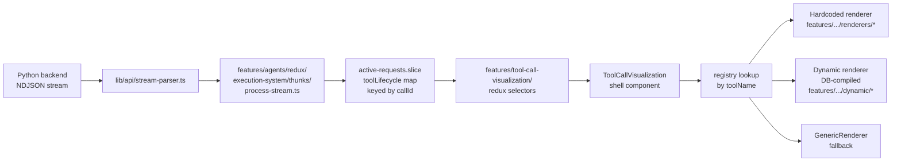

# FEATURE.md — `tool-call-visualization`

**Status:** `consolidated — canonical home for all tool-call UI`
**Tier:** `1` — tools are first-class product surface, not auxiliary output
**Last updated:** `2026-05-25`

---

## Purpose

Tool call visualization turns raw backend tool invocations (args, streamed progress, output, errors) into purpose-built UI. Execution state (lifecycle building) lives in the agents feature; this feature only reads from it.

**Default rendering = one inline line, no status icons.** A tool call reads like a line of the transcript: a **verb-phrase label** + a chevron. State is conveyed by tense and motion, not by a chip — `Updating plan` (shimmering) → `Updated plan` (static) → `Failed to update plan: <reason>`. No green check, no spinner, no red X — those read as generic / childish on a professional surface, and the shimmer alone is enough motion to signal "working". Click to expand the rich renderer; tools that opt in via `keepExpandedOnStream` (web research, news, SEO) open expanded so their data streams in. This is the same single-line shell across **every** source — live stream, static markdown, and DB-loaded turns — so a tool looks identical wherever it appears. The reasoning/thinking trace got the same text-first treatment (see `features/agents/docs/STREAMING_SYSTEM.md` → `ThinkingTrace`).

Verb phrases live on the registry as `phaseLabels: { running, complete, errorPrefix? }` per tool. Common widget tools that aren't in the static registry (`update_plan`, the agent harness's "Tasks" tool, etc.) have a small built-in fallback map in `registry/registry.tsx`. Tools we haven't labeled yet fall back to `displayName` as-is with a `failed: <message>` suffix on error — informative without overreach.

The rich, purpose-built per-tool displays (a web-research panel, an SEO pass/fail matrix, news tiles — never a raw JSON dump) are the **custom variation** shown on expand or for opted-in tools. This feature owns **everything** related to tool-call UI: the renderer contract, the registry, hardcoded renderers, dynamic (DB-stored) renderers, the canonical shell, admin tooling, and the testing harness.

---

## Canonical data flow



**No intermediate shape, no `ToolCallObject`, no fabrication.** Every renderer receives `entry: ToolLifecycleEntry` directly from Redux, and optionally the raw `events: ToolEventPayload[]` log for per-step displays.

---

## Folder layout

```
features/tool-call-visualization/
├── FEATURE.md                 ← this file
├── index.ts                   ← public barrel
├── types.ts                   ← ToolRendererProps, ToolRenderer, ToolRegistry
├── registry/
│   ├── registry.tsx           ← toolRendererRegistry + resolution helpers
│   └── GenericRenderer.tsx    ← unknown-tool fallback
├── renderers/                 ← hardcoded per-tool renderers
│   ├── _shared.ts             ← shared extraction helpers
│   ├── brave-search/
│   ├── news-api/
│   ├── seo-keywords/
│   ├── seo-meta-descriptions/
│   ├── web-research/
│   ├── core-web-search/
│   ├── deep-research/
│   └── get-user-lists/
├── dynamic/                   ← DB-stored renderer pipeline
│   ├── fetcher.ts             ← Supabase queries for tool_ui_components
│   ├── compiler.ts            ← Babel-compiles stored TSX to component
│   ├── cache.ts               ← runtime component cache
│   ├── allowed-imports.ts     ← async capability registry (shared; dynamic-import + demand-load)
│   ├── DynamicToolRenderer.tsx
│   ├── DynamicToolErrorBoundary.tsx
│   ├── incident-reporter.ts   ← POSTs render failures to /api/admin/tool-ui-incidents
│   └── types.ts
├── components/
│   ├── ToolCallVisualization.tsx  ← canonical shell
│   └── ToolUpdatesOverlay.tsx     ← fullscreen overlay
├── redux/                     ← selectors + hooks that read toolLifecycle
│   └── index.ts
├── admin/                     ← admin UI for authoring dynamic renderers
│   ├── McpToolsManager.tsx
│   ├── ToolCreatePage.tsx / ToolEditPage.tsx / ToolViewPage.tsx
│   ├── ToolUiPage.tsx
│   ├── ToolUiComponentEditor.tsx
│   ├── ToolUiComponentGenerator.tsx
│   ├── ToolIncidentsPage.tsx / ToolUiIncidentViewer.tsx
│   ├── ToolTestSamplesViewer.tsx
│   ├── tool-ui-generator-prompt.ts   ← AI-gen system prompt for v2 contract
│   └── hooks/
├── testing/                   ← test harness + previews
│   ├── ToolRendererPreview.tsx
│   ├── types.ts               ← ToolStreamEvent, FinalPayload
│   └── stream-processing/     ← NDJSON fold/normalize utilities
└── utils/
    └── toolCallBlockToLifecycleEntry.ts  ← ToolCallBlock → ToolLifecycleEntry
```

---

## The renderer contract

Every renderer is a React component with this prop shape (from `types.ts`):

```ts
interface ToolRendererProps {
  entry: ToolLifecycleEntry;              // primary data
  events?: ToolEventPayload[];            // raw per-callId log (opt-in)
  onOpenOverlay?: (initialTab?: string) => void;
  toolGroupId?: string;                   // mirrors entry.callId
  isPersisted?: boolean;                  // true for post-stream snapshots
}
```

`ToolLifecycleEntry` lives in `features/agents/types/request.types.ts` and exposes `callId`, `toolName`, `status` (`started | progress | step | result_preview | completed | error`), `arguments`, `result`, `errorMessage`, `latestMessage`, and `events`.

`ToolEventPayload` is the exact wire format from `types/python-generated/stream-events.ts`.

---

## Resolution order

`getInlineRenderer(toolName)` and `getOverlayRenderer(toolName)` resolve in this order:

1. **Static registry** — hardcoded renderers registered in `registry/registry.tsx`
2. **Dynamic DB cache** — previously-compiled `tool_ui_components` rows
3. **`DynamicToolRenderer`** — fetches on mount and compiles on demand
4. **`GenericRenderer`** — fallback table of args/result/status

---

## Contract versions

The `tool_ui_components` table carries a `contract_version` column:

- **v1** — old `toolUpdates: ToolCallObject[]` contract. No longer compiled; the dynamic compiler stubs v1 components to force fallback to `GenericRenderer`. Legacy DB rows remain until converted.
- **v2** — current canonical contract (`ToolRendererProps` above). All new rows default to v2. Admins mark v1 rows as v2 via the **Mark as v2** button in `ToolUiComponentEditor` after manually updating the stored code.

---

## Authoring guide — hardcoded renderer

See `.cursor/skills/create-tool-renderer/SKILL.md` for the full workflow and `EXPANSION.md` for the current-state expansion guide (data paths, default vs custom, DB shapes). In short:

1. Create `features/tool-call-visualization/renderers/<kebab-tool-name>/InlineComponent.tsx` and (optionally) `OverlayComponent.tsx`.
2. Read from `entry` (always) and `events` (only if you need per-step history).
3. Import shared extraction helpers from `../_shared.ts`.
4. Register the renderer in `registry/registry.tsx`.

---

## Authoring guide — dynamic renderer

1. Go to `/administration/mcp-tools/[toolId]/ui`.
2. Either write the component directly in `ToolUiComponentEditor` or generate a draft with `ToolUiComponentGenerator` (powered by the system prompt in `admin/tool-ui-generator-prompt.ts`).
3. New rows are v2 by default. The editor enforces the `ToolRendererProps` shape.
4. Save. The row is fetched, compiled, and cached on first use.

---

## What lives outside the feature (by design)

| Path | Why it stays outside |
|---|---|
| `types/python-generated/stream-events.ts` | Auto-generated wire format shared across backends |
| `features/agents/types/request.types.ts` | `ToolLifecycleEntry` — shared execution type |
| `features/agents/redux/execution-system/thunks/process-stream.ts` | Builds the lifecycle entries (execution concern) |
| `features/agents/redux/execution-system/active-requests/active-requests.slice.ts` | Owns the `toolLifecycle` map (execution concern) |
| `features/agents/redux/tools/*` | Catalog slice for the `public.tools` table (orthogonal) |
| `app/api/admin/tool-ui-components/*`, `app/api/admin/tool-ui-incidents/*`, `app/api/admin/mcp-tools/*`, `app/api/tool-testing/samples/*` | HTTP surface; business logic validates at the route boundary |
| `app/(authenticated)/(admin-auth)/administration/mcp-tools/*` | Thin route wrappers over `admin/` components |
| `app/(public)/demos/api-tests/tool-testing/page.tsx` + demo-specific UI | Route file + harness UI shell |
| `lib/chat-protocol/types.ts`, `from-stream.ts` | Generic `ToolCallBlock` used by markdown rendering; mapped into `ToolLifecycleEntry` via `utils/toolCallBlockToLifecycleEntry.ts` for surfaces that can't access the live execution pipeline |

---

## Migration notes

The consolidation (Phases 1–10) eliminated six legacy homes for tool UI:

- `lib/tool-renderers/` → moved to `features/tool-call-visualization/registry/`, `renderers/`, `dynamic/`
- `features/chat/components/response/tool-renderers/` → deleted (agent-runner is the only live consumer)
- `RequestToolVisualization`, `ReduxToolVisualization` → replaced by `ToolCallVisualization`
- `ToolCallObject[]` pipeline, `toolCallBlockToLegacy`, `canonicalArrayToLegacy`, `buildToolCallObjects` → deleted; renderers consume `ToolLifecycleEntry` directly
- `ResponseState.toolUpdates` / `ResponseState.rawToolEvents` socket-io fields → removed; the execution pipeline is the only state owner
- `components/admin/` tool admin UI → moved to `features/tool-call-visualization/admin/`

Historical planning and analysis docs from the pre-consolidation era have been archived at `docs/archive/tool-call-legacy/`.

## Change log

- `2026-06-19` — claude: **Dynamic (DB `tool_ui`) v2 compile path is BROKEN — finding (see [KNOWN_DEFECTS.md](../../KNOWN_DEFECTS.md) D6).** Exercised the DB-driven renderer kind end-to-end for the first time: inserted a valid v2 row + rendered via `DynamicInlineRenderer`. The fetch works (RLS OK, `@babel/standalone` + capability chunks load 200) but `compileToolUiComponent` **never resolves** — stuck "Loading tool display…", no error (pending promise). Reproduced for full-imports, react-only, and a fresh tool name → not GET-cache/capability; the hang is `loadBabelTransform()` / `import("@babel/standalone")` in `features/dynamic-react/compile-core.ts` (suspected Turbopack-dev large-CJS dynamic-import; verify in a prod build). **0 working v2 renderers have ever existed.** Conclusion: don't fix the runtime-Babel pipeline — replace the DB renderer kind with the **declarative `ToolDisplayEntry` model** (no Babel, no hang, user-safe), per the overhaul plan. Hardcoded renderers are unaffected; unregistered tools fall back to `GenericRenderer` correctly. (Demo `tool_ui` rows cleaned up; gallery dynamic section removed.)
- `2026-06-19` — claude: **Search/Research showcase — TWO versions for comparison (revives the lost comprehensive view).** `research_web` / `core_web_search` / `core_web_search_and_read` results are a TEXT blob (`# All Search Results` → per-query `## "q" (N results)` Title/URL/date groups + `<read_result>` deep-read blocks); `news_get_headlines` is JSON. Two complete takes, each inline + overlay, both with robust pure parsers: **`renderers/research-revival/`** (faithful revival of the deleted `82d55f22b^` components — animated browsing cards w/ rotating phases while live, per-query source cards w/ favicon/title/domain/date/snippet, synthesis, news image gallery w/ source filter+sort) and **`renderers/research-modern/`** (data-dense: stat rail, domain-coverage chip cloud, dense filterable source rows, graduated reveal, Perplexity-style sources-list/reading-pane overlay). Both rendered side-by-side in the gallery for A/B comparison; NOT yet registered (awaiting a pick). Note: `core-web-search` currently emits a *different* format (`🔍 Results for "q"`) — wire the chosen renderer to whichever tools emit the `# All Search Results` shape. Open: dynamic (DB `tool_ui`) renderer path still has 0 working v2 rows — must be exercised alongside the hardcoded path; dedicated full-route view for huge results not yet built.
- `2026-06-19` — claude: **Working-document live-diff.** The working-doc update tool is `ctx_patch` keyed to the working document. New `renderers/working-document/`: `applyWorkingDocPatch` (pure — str_replace via the shared `matchText` exact→fuzzy matcher; append/prepend/overwrite/insert; json_patch/json_merge → no text diff) + `WorkingDocDiffInline`, which freezes the doc's BEFORE content at tool-start, applies the patch locally for an instant optimistic before→after diff (`react-diff-viewer-continued`, inline, word-level), then reconciles to the server's authoritative content when the `context_changed` re-read lands — a slightly-different local fuzzy match is fine because the end state is the server's. `CtxPatchInline` routes working-doc patches here (live only; reloaded patches show the confirmation card); `ctx_patch` is `keepExpandedOnStream` so the diff is visible while it runs. No backend change needed — the existing re-read already delivers the final content. Verified: the patch wire is COMPLETE-at-`tool_started` (no char streaming) and the final content arrives via the `context_changed`→re-read path; `applyWorkingDocPatch` runtime-tested. Full live-flow (agent edit → reconcile) pending a live agent run.
- `2026-06-19` — claude: **Feedback pass — collapse-on-done, calm errors, UUID shortening, raw-tab rebuild.** (1) **Done/persisted tool calls collapse to one line** — only a LIVE, actively-streaming custom renderer auto-expands; on reload everything is collapsed (and a collapsed body never mounts, so queries aren't re-run). (2) **No hover backdrop** — removed the `hover:bg-muted` fill on the shell row/card. (3) **Calm errors** — the collapsed error label is now recessive (`text-muted-foreground`, no appended message), and `ToolErrorCard` is a small clean card (icon + simple label + "Details" → overlay), not a big red box. (4) **Inline tables/list cap 5→3 rows.** (5) **UUID shortening** — `shape.ts` `looksLikeUuid` + `{kind:"uuid"}`; new `ShortId` shows 8 chars + hover-to-copy, applied everywhere values render (tables, key-value, lists) so UUIDs no longer blow out row height. (6) **Raw tab rebuilt** — `RawDataView` now shows three verbatim JSONs (Tool / Input / Result) + a dedicated Error section (message + `{errorType, errorMessage, events}`) for full detail. (7) **JSON renderer → `JsonInspector`** (`components/official-candidate/json-inspector`) via `ResultJson`. Next: working-document live-diff on `ctx_patch` (needs the doc's current state + a diff view; may need a backend `new_content` field). New `renderers/sql/`: `SqlInline` (`sql` + `db_query`) and `DbSchemaInline` (`db_schema`) + `summarizeSql` (SQL→plain-English intent). The sparse-data case done right: while running, the intent line + raw SQL (highlighted ```sql```); on complete, the RESULT leads (query rows → `ResultValue` table + "N rows" badge; writes → "Inserted N rows" + returned ids/data), with the raw SQL/payload tucked behind a "Show SQL" disclosure. Multi-action `sql` handled defensively (`{rows}` vs `{inserted,ids/data}` vs updated/deleted; `data` may be a JSON string). **Shell improvement:** `ToolCallVisualization` now prefers the registry's `getHeaderSubtitle` for the collapsed-row subtitle (falling back to the generic `query`/`q`/`search` arg grab) — so the collapsed line reads "Querying \`users\`", not the raw SQL. Benefits every renderer that declares a subtitle.
- `2026-06-19` — claude: **First showcase — CTX renderers (`ctx_get` / `ctx_batch` / `ctx_patch`).** The most-used agent tools (464/144/60 calls) no longer render as the bare "CTX context get" generic; they're now polished note cards. New `renderers/ctx/`: `CtxItemCard` (type-icon chip · label · mono key · char-count badge · content via the `ResultValue` field library — so a note renders markdown, a db_ref renders a table, etc.), `CtxGetInline`, `CtxBatchInline` ("N of M retrieved" + per-item success/error rows), `CtxPatchInline` (write-confirmation card + `command` badge + echoed preview). Registered with verb-phrase labels ("Reviewing/Reviewed context", "Updating/Updated context") and `getHeaderSubtitle` (the key/label). Shape-tolerant (falls back to `ResultValue` on unexpected output). Built entirely ON the Wave 1 field library — first proof that one library lights up many tools. In the gallery `/demos/tool-viz/result-fields`.
- `2026-06-19` — claude: **Generic overhaul Wave 1 — type-aware result field library + rebuilt `GenericRenderer` + persisted/live parity (P0-1).** New `result-fields/` library (`shape.ts` `detectResultShape` → recursive `ResultValue` → `KeyValueGrid` / `ResultTable` (sortable + filter) / `ResultMarkdown` / `ResultMedia` (durable via `InlineMediaRef`) / `ResultJson` (`JsonTreeViewer`) / `UrlChips` / `ResultScalar` / `EmptyResult` / `ToolErrorCard`) — semantic tokens only, no `any`. `GenericRenderer` is now status-aware (error card · honest progress · type-aware completed body, never a raw `JSON.stringify`); `ToolTabBodies` Pretty tab renders `ResultValue` (full), Raw tab always shows `{arguments, result, events}` via `ResultJson`. **P0-1 fixed:** `persistedToolEntry()` (in `utils/cxToolCallToLifecycleEntry.ts`) reconciles the `cx_tool_call` row + message stub in ONE place; the interleaved-content selector now joins the row instead of flattening it, and `DbToolCard` is a trivial passthrough — so reloaded turns render byte-identically to live (real `execution_events` + timestamps, no more `events: []`). Verified at the canonical chat width (`max-w-3xl`, 768px) via the new dev gallery `/demos/tool-viz/result-fields`. The field library is the shared base the declarative model + showcase renderers (CTX / research / SQL) build on next.
- `2026-06-19` — composer: **`random_wheel` renderer** — unified radial label orientation (outer rim → hub, upright on all segments); post-land drag-to-spin with snap + highlight; user pick writes to instance context via optional `conversationId` on `ToolRendererProps`; context keys always prefixed `wheel_` (explicit `context_key: "topic"` → `wheel_topic`).
- `2026-06-19` — composer: **`EXPANSION.md` added** — operational guide for scaling tool UIs: live vs persisted ingress, `ToolLifecycleEntry` field mapping, `cx_tool_call` / `tool_ui` shapes, default (`GenericRenderer`) vs static vs dynamic resolution, shell `phaseLabels` contract, persisted `events: []` gap. **`create-tool-renderer` skill updated** to match single-line shell, `phaseLabels`, `OverlayTabs`, `onOpenWindowPanel`, `tool_ui` table name.
- `2026-06-19` — composer: **`allowed-imports.ts` is now the shared, async, demand-loaded capability registry.** Loaders changed from sync `require()` to per-module dynamic `import()`; `buildToolRendererScope()` is now `async` and loads only the requested capabilities (each its own bundle chunk) — applied in list order so spread-key precedence is deterministic. The compiler's `compileComponentCode` / `compileUtilityCode` / `compileHeaderFunction` are now `async` and awaited in `compileToolUiComponent`. All original import paths/strategies are preserved (no existing tool breaks); added the full common shadcn UI set plus heavy demand-only libs: `recharts`, `motion/react`, `react-katex`, `react-pdf`, `xlsx`, `three`, `@react-three/fiber`, `date-fns`, `lodash`. Net: zero SSR/initial-bundle impact; heavy libs chunk-in only when a component references them. New helpers: `detectReactCapabilities(code)`, `getCoreCapabilityPaths()`. Shared by `features/dynamic-react` (inline React code blocks) — see its `FEATURE.md`.
- `2026-06-15` — claude: **`rag_search` citation links now open in a new tab.** The per-hit "open" control (`renderers/rag-search/RagSearchInline.tsx`) carried an `ExternalLink` (↗) icon but its `<Link href={citationHrefFor(...)}>` had no `target` — so it navigated **in the same tab** to an internal app route, dumping the user out of the live chat. Added `target="_blank" rel="noopener noreferrer"` so the icon is honest and the conversation stays put. **Convention:** the ↗ / `ExternalLink` icon family means "opens in a new tab / leaves here" — never put it on a same-tab internal navigation. For in-app resources prefer a window panel / drawer / modal (no ↗); reserve ↗ for genuine new-tab/external links.
- `2026-05-28` — claude: **`rag_search` renderer added** (`renderers/rag-search/RagSearchInline.tsx`). Registered with verb-phrase labels and header extras (n_hits · candidates · ms · reranker). Hits render as compact rows with a source-kind icon, a snippet (≤200 chars), a deep link via the canonical `citationHrefFor()` in `features/rag/api/search`, and an Info-icon Popover that exposes the score breakdown (vector_rank / lexical_rank / rerank_score / chunk_id) for power users. Same component is used for both inline and overlay so live-stream and persisted views render identically. Closes the "rag citations render as raw JSON" gap.
- `2026-05-25` — claude: **Status icons removed; verb-phrase labels carry the state.** Replaced the green-check / spinner / red-X icons on the slim row with a tense-driven label resolved by `getToolPhaseLabel`: `Updating plan` while running (shimmering) → `Updated plan` once done → `Failed to update plan: <reason>` on error. New optional `phaseLabels` field on `ToolRenderer` (`types.ts`) — populated for every static registry entry; a small built-in fallback map covers `update_plan` and the "Tasks" widget; unrecognized tools fall back to `displayName`. The query subtitle ("· AI lawyers") is kept ONLY when present and informative; the redundant `latestMessage` ("Executing X") is dropped from the slim row entirely. Spinner / green-check / red-AlertCircle removed; chevron stays as the only affordance.
- `2026-05-25` — claude: **Tool calls now render as a single inline line by default**, unified across live-stream, static, and DB sources. The `ToolCallVisualization` shell dropped the heavy "comfortable" box branch — every tool is a borderless one-line row (status icon · display name · message) that collapses by default; click to expand the custom/generic renderer. Added the missing **error** state (red `AlertCircle` + `errorMessage`) to the header. `responseDensity` no longer drives tool chrome (slim is universal; the setting's plumbing in shortcuts/config is untouched but currently a no-op for this shell — candidate for repurpose/removal). Removed the manual `useMemo`/`useCallback`/auto-collapse `useEffect` (React Compiler handles memoization; normal tools simply start collapsed). **Next:** port matrx-extend's declarative per-tool display registry (`inline`/`results`/`alwaysShow`/`CustomComponent`, phase-aware) to grow the custom-variation set.
- `2026-04-25` — Consumers of `ToolCallVisualization` and `toolCallBlockToLifecycleEntry` import from `components/ToolCallVisualization` and `utils/toolCallBlockToLifecycleEntry` instead of the feature root barrel.
