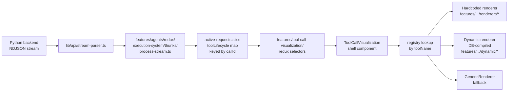

# FEATURE.md — `tool-call-visualization`

**Status:** `consolidated — canonical home for all tool-call UI`
**Tier:** `1` — tools are first-class product surface, not auxiliary output
**Last updated:** `2026-05-25`

---

## Purpose

Tool call visualization turns raw backend tool invocations (args, streamed progress, output, errors) into purpose-built UI. Execution state (lifecycle building) lives in the agents feature; this feature only reads from it.

**Default rendering = one inline line, no status icons.** A tool call reads like a line of the transcript: a **verb-phrase label** + a chevron. State is conveyed by tense and motion, not by a chip — `Updating plan` (shimmering) → `Updated plan` (static) → `Failed to update plan: <reason>`. No green check, no spinner, no red X — those read as generic / childish on a professional surface, and the shimmer alone is enough motion to signal "working". Click to expand the rich renderer; tools that opt in via `keepExpandedOnStream` (web research, news, SEO) open expanded so their data streams in. This is the same single-line shell across **every** source — live stream, static markdown, and DB-loaded turns — so a tool looks identical wherever it appears. The reasoning/thinking trace got the same text-first treatment (see `features/agents/docs/STREAMING_SYSTEM.md` → `ThinkingTrace`).

Verb phrases live on the registry as `phaseLabels: { running, complete, errorPrefix? }` per tool. Common widget tools that aren't in the static registry (`update_plan`, the agent harness's "Tasks" tool, etc.) have a small built-in fallback map in `registry/registry.tsx`. Tools we haven't labeled yet fall back to `displayName` as-is with a `failed: <message>` suffix on error — informative without overreach.

The rich, purpose-built per-tool displays (a web-research panel, an SEO pass/fail matrix, news tiles — never a raw JSON dump) are the **custom variation** shown on expand or for opted-in tools. This feature owns **everything** related to tool-call UI: the renderer contract, the registry, hardcoded renderers, dynamic (DB-stored) renderers, the canonical shell, admin tooling, and the testing harness.

---

## Canonical data flow



**No intermediate shape, no `ToolCallObject`, no fabrication.** Every renderer receives `entry: ToolLifecycleEntry` directly from Redux, and optionally the raw `events: ToolEventPayload[]` log for per-step displays.

---

## Folder layout

```
features/tool-call-visualization/
├── FEATURE.md                 ← this file
├── index.ts                   ← public barrel
├── types.ts                   ← ToolRendererProps, ToolRenderer, ToolRegistry
├── registry/
│   ├── registry.tsx           ← toolRendererRegistry + resolution helpers
│   └── GenericRenderer.tsx    ← unknown-tool fallback
├── renderers/                 ← hardcoded per-tool renderers
│   ├── _shared.ts             ← shared extraction helpers
│   ├── brave-search/
│   ├── news-api/
│   ├── seo-keywords/
│   ├── seo-meta-descriptions/
│   ├── web-research/
│   ├── core-web-search/
│   ├── deep-research/
│   └── get-user-lists/
├── dynamic/                   ← DB-stored renderer pipeline
│   ├── fetcher.ts             ← Supabase queries for tool_ui_components
│   ├── compiler.ts            ← Babel-compiles stored TSX to component
│   ├── cache.ts               ← runtime component cache
│   ├── allowed-imports.ts     ← sandbox allowlist
│   ├── DynamicToolRenderer.tsx
│   ├── DynamicToolErrorBoundary.tsx
│   ├── incident-reporter.ts   ← POSTs render failures to /api/admin/tool-ui-incidents
│   └── types.ts
├── components/
│   ├── ToolCallVisualization.tsx  ← canonical shell
│   └── ToolUpdatesOverlay.tsx     ← fullscreen overlay
├── redux/                     ← selectors + hooks that read toolLifecycle
│   └── index.ts
├── admin/                     ← admin UI for authoring dynamic renderers
│   ├── McpToolsManager.tsx
│   ├── ToolCreatePage.tsx / ToolEditPage.tsx / ToolViewPage.tsx
│   ├── ToolUiPage.tsx
│   ├── ToolUiComponentEditor.tsx
│   ├── ToolUiComponentGenerator.tsx
│   ├── ToolIncidentsPage.tsx / ToolUiIncidentViewer.tsx
│   ├── ToolTestSamplesViewer.tsx
│   ├── tool-ui-generator-prompt.ts   ← AI-gen system prompt for v2 contract
│   └── hooks/
├── testing/                   ← test harness + previews
│   ├── ToolRendererPreview.tsx
│   ├── types.ts               ← ToolStreamEvent, FinalPayload
│   └── stream-processing/     ← NDJSON fold/normalize utilities
└── utils/
    └── toolCallBlockToLifecycleEntry.ts  ← ToolCallBlock → ToolLifecycleEntry
```

---

## The renderer contract

Every renderer is a React component with this prop shape (from `types.ts`):

```ts
interface ToolRendererProps {
  entry: ToolLifecycleEntry;              // primary data
  events?: ToolEventPayload[];            // raw per-callId log (opt-in)
  onOpenOverlay?: (initialTab?: string) => void;
  toolGroupId?: string;                   // mirrors entry.callId
  isPersisted?: boolean;                  // true for post-stream snapshots
}
```

`ToolLifecycleEntry` lives in `features/agents/types/request.types.ts` and exposes `callId`, `toolName`, `status` (`started | progress | step | result_preview | completed | error`), `arguments`, `result`, `errorMessage`, `latestMessage`, and `events`.

`ToolEventPayload` is the exact wire format from `types/python-generated/stream-events.ts`.

---

## Resolution order

`getInlineRenderer(toolName)` and `getOverlayRenderer(toolName)` resolve in this order:

1. **Static registry** — hardcoded renderers registered in `registry/registry.tsx`
2. **Dynamic DB cache** — previously-compiled `tool_ui_components` rows
3. **`DynamicToolRenderer`** — fetches on mount and compiles on demand
4. **`GenericRenderer`** — fallback table of args/result/status

---

## Contract versions

The `tool_ui_components` table carries a `contract_version` column:

- **v1** — old `toolUpdates: ToolCallObject[]` contract. No longer compiled; the dynamic compiler stubs v1 components to force fallback to `GenericRenderer`. Legacy DB rows remain until converted.
- **v2** — current canonical contract (`ToolRendererProps` above). All new rows default to v2. Admins mark v1 rows as v2 via the **Mark as v2** button in `ToolUiComponentEditor` after manually updating the stored code.

---

## Authoring guide — hardcoded renderer

See `.cursor/skills/create-tool-renderer/SKILL.md` for the full workflow. In short:

1. Create `features/tool-call-visualization/renderers/<kebab-tool-name>/InlineComponent.tsx` and (optionally) `OverlayComponent.tsx`.
2. Read from `entry` (always) and `events` (only if you need per-step history).
3. Import shared extraction helpers from `../_shared.ts`.
4. Register the renderer in `registry/registry.tsx`.

---

## Authoring guide — dynamic renderer

1. Go to `/administration/mcp-tools/[toolId]/ui`.
2. Either write the component directly in `ToolUiComponentEditor` or generate a draft with `ToolUiComponentGenerator` (powered by the system prompt in `admin/tool-ui-generator-prompt.ts`).
3. New rows are v2 by default. The editor enforces the `ToolRendererProps` shape.
4. Save. The row is fetched, compiled, and cached on first use.

---

## What lives outside the feature (by design)

| Path | Why it stays outside |
|---|---|
| `types/python-generated/stream-events.ts` | Auto-generated wire format shared across backends |
| `features/agents/types/request.types.ts` | `ToolLifecycleEntry` — shared execution type |
| `features/agents/redux/execution-system/thunks/process-stream.ts` | Builds the lifecycle entries (execution concern) |
| `features/agents/redux/execution-system/active-requests/active-requests.slice.ts` | Owns the `toolLifecycle` map (execution concern) |
| `features/agents/redux/tools/*` | Catalog slice for the `public.tools` table (orthogonal) |
| `app/api/admin/tool-ui-components/*`, `app/api/admin/tool-ui-incidents/*`, `app/api/admin/mcp-tools/*`, `app/api/tool-testing/samples/*` | HTTP surface; business logic validates at the route boundary |
| `app/(authenticated)/(admin-auth)/administration/mcp-tools/*` | Thin route wrappers over `admin/` components |
| `app/(public)/demos/api-tests/tool-testing/page.tsx` + demo-specific UI | Route file + harness UI shell |
| `lib/chat-protocol/types.ts`, `from-stream.ts` | Generic `ToolCallBlock` used by markdown rendering; mapped into `ToolLifecycleEntry` via `utils/toolCallBlockToLifecycleEntry.ts` for surfaces that can't access the live execution pipeline |

---

## Migration notes

The consolidation (Phases 1–10) eliminated six legacy homes for tool UI:

- `lib/tool-renderers/` → moved to `features/tool-call-visualization/registry/`, `renderers/`, `dynamic/`
- `features/chat/components/response/tool-renderers/` → deleted (agent-runner is the only live consumer)
- `RequestToolVisualization`, `ReduxToolVisualization` → replaced by `ToolCallVisualization`
- `ToolCallObject[]` pipeline, `toolCallBlockToLegacy`, `canonicalArrayToLegacy`, `buildToolCallObjects` → deleted; renderers consume `ToolLifecycleEntry` directly
- `ResponseState.toolUpdates` / `ResponseState.rawToolEvents` socket-io fields → removed; the execution pipeline is the only state owner
- `components/admin/` tool admin UI → moved to `features/tool-call-visualization/admin/`

Historical planning and analysis docs from the pre-consolidation era have been archived at `docs/archive/tool-call-legacy/`.

## Change log

- `2026-06-15` — claude: **`rag_search` citation links now open in a new tab.** The per-hit "open" control (`renderers/rag-search/RagSearchInline.tsx`) carried an `ExternalLink` (↗) icon but its `<Link href={citationHrefFor(...)}>` had no `target` — so it navigated **in the same tab** to an internal app route, dumping the user out of the live chat. Added `target="_blank" rel="noopener noreferrer"` so the icon is honest and the conversation stays put. **Convention:** the ↗ / `ExternalLink` icon family means "opens in a new tab / leaves here" — never put it on a same-tab internal navigation. For in-app resources prefer a window panel / drawer / modal (no ↗); reserve ↗ for genuine new-tab/external links.
- `2026-05-28` — claude: **`rag_search` renderer added** (`renderers/rag-search/RagSearchInline.tsx`). Registered with verb-phrase labels and header extras (n_hits · candidates · ms · reranker). Hits render as compact rows with a source-kind icon, a snippet (≤200 chars), a deep link via the canonical `citationHrefFor()` in `features/rag/api/search`, and an Info-icon Popover that exposes the score breakdown (vector_rank / lexical_rank / rerank_score / chunk_id) for power users. Same component is used for both inline and overlay so live-stream and persisted views render identically. Closes the "rag citations render as raw JSON" gap.
- `2026-05-25` — claude: **Status icons removed; verb-phrase labels carry the state.** Replaced the green-check / spinner / red-X icons on the slim row with a tense-driven label resolved by `getToolPhaseLabel`: `Updating plan` while running (shimmering) → `Updated plan` once done → `Failed to update plan: <reason>` on error. New optional `phaseLabels` field on `ToolRenderer` (`types.ts`) — populated for every static registry entry; a small built-in fallback map covers `update_plan` and the "Tasks" widget; unrecognized tools fall back to `displayName`. The query subtitle ("· AI lawyers") is kept ONLY when present and informative; the redundant `latestMessage` ("Executing X") is dropped from the slim row entirely. Spinner / green-check / red-AlertCircle removed; chevron stays as the only affordance.
- `2026-05-25` — claude: **Tool calls now render as a single inline line by default**, unified across live-stream, static, and DB sources. The `ToolCallVisualization` shell dropped the heavy "comfortable" box branch — every tool is a borderless one-line row (status icon · display name · message) that collapses by default; click to expand the custom/generic renderer. Added the missing **error** state (red `AlertCircle` + `errorMessage`) to the header. `responseDensity` no longer drives tool chrome (slim is universal; the setting's plumbing in shortcuts/config is untouched but currently a no-op for this shell — candidate for repurpose/removal). Removed the manual `useMemo`/`useCallback`/auto-collapse `useEffect` (React Compiler handles memoization; normal tools simply start collapsed). **Next:** port matrx-extend's declarative per-tool display registry (`inline`/`results`/`alwaysShow`/`CustomComponent`, phase-aware) to grow the custom-variation set.
- `2026-04-25` — Consumers of `ToolCallVisualization` and `toolCallBlockToLifecycleEntry` import from `components/ToolCallVisualization` and `utils/toolCallBlockToLifecycleEntry` instead of the feature root barrel.
