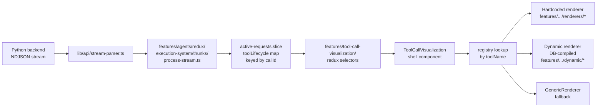

# FEATURE.md — `tool-call-visualization`

**Status:** `consolidated — canonical home for all tool-call UI`
**Tier:** `1` — tools are first-class product surface, not auxiliary output
**Last updated:** `2026-06-22`

---

## Purpose

Tool call visualization turns raw backend tool invocations (args, streamed progress, output, errors) into purpose-built UI. Execution state (lifecycle building) lives in the agents feature; this feature only reads from it.

**Default rendering = one inline line, no status icons.** A tool call reads like a line of the transcript: a **verb-phrase label** + a chevron. State is conveyed by tense and motion, not by a chip — `Updating plan` (shimmering) → `Updated plan` (static) → `Failed to update plan: <reason>`. No green check, no spinner, no red X — those read as generic / childish on a professional surface, and the shimmer alone is enough motion to signal "working". Click to expand the rich renderer; tools that opt in via `keepExpandedOnStream` (web research, news, SEO) open expanded so their data streams in. This is the same single-line shell across **every** source — live stream, static markdown, and DB-loaded turns — so a tool looks identical wherever it appears. The reasoning/thinking trace got the same text-first treatment (see `features/agents/docs/STREAMING_SYSTEM.md` → `ThinkingTrace`).

Verb phrases live on the registry as `phaseLabels: { running, complete, errorPrefix? }` per tool. Common widget tools that aren't in the static registry (`update_plan`, the agent harness's "Tasks" tool, etc.) have a small built-in fallback map in `registry/registry.tsx`. Tools we haven't labeled yet fall back to `displayName` as-is with a `failed: <message>` suffix on error — informative without overreach.

**Consecutive tool calls fold.** A run of **≥2 back-to-back** tool calls (no text/thinking between them) collapses into ONE `ToolCallBatch` line (`components/ToolCallBatch.tsx`) — "Updated `tool_def` · 10 calls" (uniform) or "N tool calls" (mixed) — that expands to the FULL normal tool cards flat below a subtle left rail. **No nesting that deforms the cards:** the batch is just a toggle line; each child is a normal `ToolCallVisualization`, full-width and independently expandable. Same collapse behavior as the shell (expanded while any tool streams → auto-collapse 3s after done; user pref wins). Grouping happens in `EnhancedChatMarkdown` (`groupConsecutiveToolSlots` / `groupConsecutiveDbTools`); the live/persisted wrappers `InlineToolBatch` / `DbToolBatch` reuse the existing single-tool cards as children.

The rich, purpose-built per-tool displays (a web-research panel, a real Google-SERP preview for the SEO checks, news tiles — never a raw JSON dump) are the **custom variation** shown on expand or for opted-in tools. This feature owns **everything** related to tool-call UI: the renderer contract, the registry, hardcoded renderers, dynamic (DB-stored) renderers, the canonical shell, admin tooling, and the testing harness.

---

## Canonical data flow



**No intermediate shape, no `ToolCallObject`, no fabrication.** Every renderer receives `entry: ToolLifecycleEntry` directly from Redux, and optionally the raw `events: ToolEventPayload[]` log for per-step displays.

---

## Folder layout

```
features/tool-call-visualization/
├── FEATURE.md                 ← this file
├── index.ts                   ← public barrel
├── types.ts                   ← ToolRendererProps, ToolRenderer, ToolRegistry
├── registry/
│   ├── registry.tsx           ← toolRendererRegistry + resolution helpers
│   └── GenericRenderer.tsx    ← unknown-tool fallback
├── renderers/                 ← hardcoded per-tool renderers
│   ├── _shared.ts             ← shared extraction helpers
│   ├── search/                ← CANONICAL search renderer (web_search, core_web_search, web_search_v1)
│   │   ├── parseSearch.ts        ← the ONE search/research parser + favicon/domain/base-URL-dedupe utils
│   │   ├── useGraduatedReveal.ts ← paced client-side reveal (the "flow in" conveyor)
│   │   ├── SearchInline.tsx      ← LIVE rolling-window feed → PERSISTENT Google-class view
│   │   └── SearchOverlay.tsx     ← full "hide nothing" Results body (filter · sort · all sources)
│   ├── news-api/
│   ├── seo-keywords/
│   ├── seo-shared/             ← SerpToolInline + SerpToolOverlay — ONE inline/overlay for all 3 SEO checks
│   ├── seo-meta-tags/          ← seo_check_meta_tags_batch (thin adapters → seo-shared, real SERP)
│   ├── seo-meta-titles/        ← seo_check_meta_titles (title-only SERP)
│   ├── seo-meta-descriptions/  ← seo_check_meta_descriptions (description-only SERP)
│   ├── deep-research/          ← research_web / core_web_search_and_read (Wave 3)
│   └── get-user-lists/
├── dynamic/                   ← DB-stored renderer pipeline
│   ├── fetcher.ts             ← Supabase queries for tool_ui_components
│   ├── compiler.ts            ← Babel-compiles stored TSX to component
│   ├── cache.ts               ← runtime component cache
│   ├── allowed-imports.ts     ← async capability registry (shared; dynamic-import + demand-load)
│   ├── DynamicToolRenderer.tsx
│   ├── DynamicToolErrorBoundary.tsx
│   ├── incident-reporter.ts   ← POSTs render failures to /api/admin/tool-ui-incidents
│   └── types.ts
├── components/
│   ├── ToolCallVisualization.tsx  ← canonical shell
│   └── ToolUpdatesOverlay.tsx     ← fullscreen overlay
├── redux/                     ← selectors + hooks that read toolLifecycle
│   └── index.ts
├── admin/                     ← admin UI for authoring dynamic renderers
│   ├── McpToolsManager.tsx
│   ├── ToolCreatePage.tsx / ToolEditPage.tsx / ToolViewPage.tsx
│   ├── ToolUiPage.tsx
│   ├── ToolUiComponentEditor.tsx
│   ├── ToolUiComponentGenerator.tsx
│   ├── ToolIncidentsPage.tsx / ToolUiIncidentViewer.tsx
│   ├── ToolTestSamplesViewer.tsx
│   ├── tool-ui-generator-prompt.ts   ← AI-gen system prompt for v2 contract
│   └── hooks/
├── testing/                   ← test harness + previews
│   ├── ToolRendererPreview.tsx
│   ├── types.ts               ← ToolStreamEvent, FinalPayload
│   └── stream-processing/     ← NDJSON fold/normalize utilities
└── utils/
    └── toolCallBlockToLifecycleEntry.ts  ← ToolCallBlock → ToolLifecycleEntry
```

---

## The renderer contract

Every renderer is a React component with this prop shape (from `types.ts`):

```ts
interface ToolRendererProps {
  entry: ToolLifecycleEntry;              // primary data
  events?: ToolEventPayload[];            // raw per-callId log (opt-in)
  onOpenOverlay?: (initialTab?: string) => void;
  toolGroupId?: string;                   // mirrors entry.callId
  isPersisted?: boolean;                  // true for post-stream snapshots
}
```

`ToolLifecycleEntry` lives in `features/agents/types/request.types.ts` and exposes `callId`, `toolName`, `status` (`started | progress | step | result_preview | completed | error`), `arguments`, `result`, `errorMessage`, `latestMessage`, and `events`.

`ToolEventPayload` is the exact wire format from `types/python-generated/stream-events.ts`.

---

## Resolution order

`getInlineRenderer(toolName)` and `getOverlayRenderer(toolName)` resolve in this order:

1. **Static registry** — hardcoded renderers registered in `registry/registry.tsx`
2. **Dynamic DB cache** — previously-compiled `tool_ui_components` rows
3. **`DynamicToolRenderer`** — fetches on mount and compiles on demand
4. **`GenericRenderer`** — fallback table of args/result/status

---

## Contract versions

The `tool_ui_components` table carries a `contract_version` column:

- **v1** — old `toolUpdates: ToolCallObject[]` contract. No longer compiled; the dynamic compiler stubs v1 components to force fallback to `GenericRenderer`. Legacy DB rows remain until converted.
- **v2** — current canonical contract (`ToolRendererProps` above). All new rows default to v2. Admins mark v1 rows as v2 via the **Mark as v2** button in `ToolUiComponentEditor` after manually updating the stored code.

---

## Authoring guide — hardcoded renderer

See `.cursor/skills/create-tool-renderer/SKILL.md` for the full workflow and `EXPANSION.md` for the current-state expansion guide (data paths, default vs custom, DB shapes). In short:

1. Create `features/tool-call-visualization/renderers/<kebab-tool-name>/InlineComponent.tsx` and (optionally) `OverlayComponent.tsx`.
2. Read from `entry` (always) and `events` (only if you need per-step history).
3. Import shared extraction helpers from `../_shared.ts`.
4. Register the renderer in `registry/registry.tsx`.

---

## Authoring guide — dynamic renderer

1. Go to `/administration/mcp-tools/[toolId]/ui`.
2. Either write the component directly in `ToolUiComponentEditor` or generate a draft with `ToolUiComponentGenerator` (powered by the system prompt in `admin/tool-ui-generator-prompt.ts`).
3. New rows are v2 by default. The editor enforces the `ToolRendererProps` shape.
4. Save. The row is fetched, compiled, and cached on first use.

---

## What lives outside the feature (by design)

| Path | Why it stays outside |
|---|---|
| `types/python-generated/stream-events.ts` | Auto-generated wire format shared across backends |
| `features/agents/types/request.types.ts` | `ToolLifecycleEntry` — shared execution type |
| `features/agents/redux/execution-system/thunks/process-stream.ts` | Builds the lifecycle entries (execution concern) |
| `features/agents/redux/execution-system/active-requests/active-requests.slice.ts` | Owns the `toolLifecycle` map (execution concern) |
| `features/agents/redux/tools/*` | Catalog slice for the `public.tools` table (orthogonal) |
| `app/api/admin/tool-ui-components/*`, `app/api/admin/tool-ui-incidents/*`, `app/api/admin/mcp-tools/*`, `app/api/tool-testing/samples/*` | HTTP surface; business logic validates at the route boundary |
| `app/(authenticated)/(admin-auth)/administration/mcp-tools/*` | Thin route wrappers over `admin/` components |
| `app/(public)/demos/api-tests/tool-testing/page.tsx` + demo-specific UI | Route file + harness UI shell |
| `lib/chat-protocol/types.ts`, `from-stream.ts` | Generic `ToolCallBlock` used by markdown rendering; mapped into `ToolLifecycleEntry` via `utils/toolCallBlockToLifecycleEntry.ts` for surfaces that can't access the live execution pipeline |

---

## Migration notes

The consolidation (Phases 1–10) eliminated six legacy homes for tool UI:

- `lib/tool-renderers/` → moved to `features/tool-call-visualization/registry/`, `renderers/`, `dynamic/`
- `features/chat/components/response/tool-renderers/` → deleted (agent-runner is the only live consumer)
- `RequestToolVisualization`, `ReduxToolVisualization` → replaced by `ToolCallVisualization`
- `ToolCallObject[]` pipeline, `toolCallBlockToLegacy`, `canonicalArrayToLegacy`, `buildToolCallObjects` → deleted; renderers consume `ToolLifecycleEntry` directly
- `ResponseState.toolUpdates` / `ResponseState.rawToolEvents` socket-io fields → removed; the execution pipeline is the only state owner
- `components/admin/` tool admin UI → moved to `features/tool-call-visualization/admin/`

Historical planning and analysis docs from the pre-consolidation era have been archived at `docs/archive/tool-call-legacy/`.

## Change log

- `2026-06-23` — claude: **Registered the REAL `web` tool (action-dispatched) + `context_patch` — stop falling through to GenericRenderer.** A tool-name audit against live `cx_tool_call` (project `txzxabzwovsujtloxrus`) found renderers registered for STALE names: the current web tool is **`web`** (47 calls, latest today) — a SINGLE tool dispatched by `arguments.action` — and the live patch tool is **`context_patch`** (24 calls), but the patch renderer was on `ctx_patch` only. `web_search` is DEAD (last 2026-05-19). New action-dispatcher `renderers/web/` — `WebInline`/`WebOverlay` route `action:"search"` → the canonical `SearchInline`/`SearchOverlay` (Google-class results), read-like actions (`batch_read`/`read`, resolved by `webAction.ts#resolveWebActionKind`) → `ScrapeInline`/`ScrapeOverlay` (per-page cards), anything else → `GenericRenderer`. The dispatcher is a PURE passthrough of `ToolRendererProps` and adds NO frame — so a "Web · N calls" batch is not triple-bordered (the card shell draws the one frame; search/scrape render flush). Registered `web` (inline+overlay, neutral "Web" phase label, action-aware header subtitle/extras, `keepExpandedOnStream`, added to `RESULT_IS_PURPOSE_TOOLS`) and `context_patch` (same `CtxPatchInline`→`PatchDiffInline` renderer + config as `ctx_patch`). `web_search`/`core_web_search`/`web_read`/`core_web_read_web_pages` kept registered (harmless for old data). The `/in-action` simulator (`recordingFor`) now dispatches a saved `web` run by action (search→`buildSearchRecording`, read→`buildScrapeRecording`). `tsc` 0 errors. **Verified live** (`/demos/tool-viz/in-action` → Real saved runs → Web): the SEARCH run rendered the Google-class `SearchInline` (8 Google favicons, success-green `cwilc.com` breadcrumb, blue title links, visible 2-line snippets — NO raw `Title:/URL:/Description:` dump) and the BATCH_READ run rendered the `ScrapeInline` page cards ("Read N pages", per-page char counts incl. a graceful 47-char "could not extract" page, "View page" — NO `Url/Content/Success` generic table); border-nesting confirmed (search row → 1 bordered ancestor = shell frame; read card → 2 = shell frame + the legitimate per-page card; never 3). `research_web` still renders `ResearchInline` (untouched). **NOTE:** `fetch_url_as_markdown` (42 calls, last 2026-05-26) has NO custom renderer yet — flagged for later. Full audit in `STREAMING_OVERHAUL_PLAN.md` → "TOOL-NAME AUDIT (verified 2026-06-23)".
- `2026-06-23` — claude: **SEO meta checks now render the REAL thing — a simulated Google search result — by sharing the calculator page's SERP component.** The three SEO tools (`seo_check_meta_tags_batch` / `seo_check_meta_titles` / `seo_check_meta_descriptions`) previously rendered as abstract colored rows + progress bars. They now bring the agent's output to life as actual Google results, via a NEW canonical primitive `features/seo/serp/` — `SerpResult` (one simulated result: favicon · domain · breadcrumb · `text-primary` title link · 2-line snippet, `device` desktop/mobile × `density` full/compact, graceful title-only / description-only), `SerpSearchChrome` (search box + tab row + result count), `SerpValidation` (`SerpFieldBars` char/pixel bars + device checks, `SerpFieldChips`), `metrics.ts` (the SINGLE source of truth for SEO limits + canvas measurement, mirrored to the aidream backend: title 600/500px·60ch, desc 920/680px·160ch), `types.ts` (each tool's server item → one `SerpEntry`). The SAME primitive backs the live calculator page (`app/(public)/seo/metadata` — `MetaInputWidget` refactored onto it, deleting its inline SERP markup + a real drift bug where it checked the title at 580px desktop / 920px **mobile** vs the backend's 600/500). Tool side: ONE shared `seo-shared/SerpToolInline` (compact stacked results, trusts the server's precomputed `*_ok`/pixels/chars, copy-title/copy-description) + `seo-shared/SerpToolOverlay` (a full results PAGE: search chrome → pass/fail filter → full-size results each with `SerpFieldBars` + the server's `*_issues`), with the 5 tool entry files as thin normalize-and-delegate adapters. **Added** overlays for titles + descriptions (had none — fell back to inline). **Killed** the 3 inline `index.ts` barrels (registry imports from source). `CopyButton` gained an optional `tooltip` (icon-only + specific hover text). `tsc` 0 errors + eslint clean; data contract verified against 29 real production `seo_check_meta_*` runs (`cx_tool_call`) — `batch_analysis` items carry exactly `{title,description,title_pixels,title_chars,title_ok,title_issues[],description_*,overall_ok}`, `*_issues` populated. **Verify live:** `/demos/tool-viz/in-action` → Real saved runs → the three SEO tools (22/4/3 runs on this account); and `/seo/metadata`.
- `2026-06-23` — claude: **SEARCH display rebuilt to "Google done right" + the live-reveal gate fixed (`renderers/search/`).** The persistent ("done") view is now a real Google search-results page: each row = favicon + a muted-green **breadcrumb** (`domain › path › segments`, domain via the semantic `text-success` token) + a prominent `text-primary` **title link** + an **ALWAYS-visible 2-line description snippet** (the old `SourceRow` hid the snippet AND the domain behind `group-hover:opacity-100` — killed; nothing is behind hover now except the external-link/Read-page action icons). Generous vertical spacing replaced the cramped `divide-y` rows. **Parallel queries render as SEPARATE, stacked result blocks** — each headed by its query + result count, reading like its own little results page (no filter pills, no mashed list); a single query is one unified block. An AI answer/`report` (research) still leads in a Perplexity-style card. **Live-reveal fix (the owner's "yours don't stream"):** root cause was the `/in-action` demo passing a FAKE `requestId="sim"` — `selectIsLatestToolActivity` reads `byRequestId["sim"]` which doesn't exist → always `false` → the live phase was NEVER shown, it dumped the persistent view. Fixed two ways: (a) the demo no longer passes a fake requestId (so the renderer falls back to `entry.status` and streams while non-terminal); (b) `SearchInline`'s gate is now `showLive = !complete || isLatestActivity` — a running tool ALWAYS shows the live conveyor regardless of Redux, and a just-completed tool keeps conveying from its now-whole result while it's still the stream's latest activity, then snaps. The conveyor still paces client-side via `useGraduatedReveal` (data lands whole at `tool_completed`), shows **"Searching '<query>'"** the instant args arrive, and caps at ~4 sliding rows. **Scrape → window panel:** each result row gained a hover **"Read full page"** affordance (`onOpenWindowPanel` from `ToolRendererProps`, wired by `ToolCallVisualization`) that opens the `toolCallWindow` WindowPanel populated with every tool in the request — including any `web_read`/scrape of the same URLs as its own tab (no fabricated scrape). `SearchOverlay` got the same Google-class rows + per-query-block default. Semantic tokens only; `Sparkles` (banned) → `Lightbulb`. `tsc` + eslint clean. **Verified live** (`/demos/tool-viz/result-fields` + `/demos/tool-viz/in-action` on a REAL saved `web_search` run): snippet `opacity:1` 2-line clamp, green breadcrumb (`rgb(22,162,73)`), blue 15px title link, per-query blocks, the live "Searching 3 queries" → conveyor (≤4 cards) → "N of M results…" → snap-to-persistent lifecycle, and the window panel opening with the results page inside (DOM + screenshots).
- `2026-06-23` — claude: **`in-action` demo rebuilt as a FAITHFUL replica of a `/chat` tool turn (`(dev)/demos/tool-viz/in-action`).** One streamed assistant turn — intro markdown → `<thinking>` (`ThinkingTrace`) → "about to act" header → the tool call → wrap-up markdown — rendered with the SAME components the live transcript uses (`MarkdownStream` for assistant text, `ThinkingTrace`, `ToolCallVisualization`), so spacing/width are byte-identical to production. **Width fix (the owner's complaint — "smaller, pushed to the side, moves with the controls"):** the render area is now `<ChatResultColumn>` (`max-w-3xl mx-auto px-2` — the exact constraint `AgentConversationColumn` applies via its `edgeToEdgeScroll` centerWrap), on `bg-background`, centered, in a SEPARATE block from the toolbar so controls can never change its width/position. **Measured 768px == the live `/chat` transcript+input column (also 768px) at 1280px viewport.** **Speed control:** `useSimulatedToolEntry` gained a `speed?` multiplier (every step `afterMs / rate`, clamped); the page threads one `speed` into the tool stream AND both markdown/thinking reveals, scaled live by 0.5×/1×/2×/4× buttons (+ Play/Reset). **Real data:** the tool is driven by the latest successful `cx_tool_call` row for the picked tool (converted via `cxToolCallToLifecycleEntry`), with an instant synthetic fallback (no loading dead-end — the column paints on first frame, then upgrades to real data). Tool picker pulls from the registered inline renderers (`toolRendererRegistry`, tagged "custom UI") + curated DB-sample tools. All semantic tokens. `tsc` clean. (Verified by DOM measurement + screenshot; live click-driven playback unverifiable in the flaky dev preview — clicks/timers don't reach React there — but the stream + speed wiring is verified end-to-end statically and the simulator is the same code the gallery already exercises.)
- `2026-06-23` — claude: **`note` renderer Preview now uses the canonical render-block renderer + faithful preview surface.** (1) `NotePreview` (`renderers/note/NoteToolParts.tsx`) renders content via **`MarkdownStream`** (the same renderer `markdown-studio`'s `PreviewPanel` uses) instead of the thin `BasicMarkdownContent`, so notes with render blocks (mermaid, tables, flashcards, …) render as blocks, not raw fences — verified live: a mermaid note renders as a flowchart diagram, a markdown table as a table. (2) New **`components/ChatResultColumn.tsx`** — wraps a preview at the EXACT width + surface a tool gets in the live chat (`w-full max-w-3xl mx-auto px-2`, no card/border/bg, matching `AgentConversationColumn`). The gallery + "in action" demos wrapped tool renders in decorative `bg-card` panels that lied about production (stray borders / bg shifts); both now render through `ChatResultColumn`. (3) **`note` added to the "in action" page** (`(dev)/demos/tool-viz/in-action`): a "Save a note" simulated scenario, and the **"Real saved run" loader is now super-admin cross-user** — a new gated route `app/api/admin/tool-call-samples` (`requireSuperAdmin` + admin client, RLS-bypassing read-only) discovers every tool with real `cx_tool_call` usage and returns recent samples across ALL users; super-admins pick any tool → see recent usages → select → render (non-admins keep the per-user direct query). The simulated assistant turn also dropped its `bg-card` bubble to match a real (transparent) assistant message.
- `2026-06-22` — claude: **Sandbox icon noise fix + `DynamicIcon` in compile scope.** False `[AgentApp] Missing icon "ShellRenderer"` warnings came from `patchScopeForMissingIdentifiers` treating every PascalCase token (default-export function names like `ShellRenderer`, constants like `LIMIT`) as missing Lucide icons. Shared `patch-scope-identifiers.ts` now patches only JSX component refs (`React.createElement` / `jsx` first args) and skips lucide proxy lookups for non-export names. `DynamicIcon` / `renderIcon` from `@/components/official/icons/IconResolver` are always injected into the Agent Apps + tool-renderer Babel scope (also registered as an allowed import); tool-ui generator prompt recommends `<DynamicIcon name="Folder" />` over per-icon imports. **`note` tool renderer (`renderers/note/`, in-code Path B).** The `note` tool result is tiny — `{ id, label, updated_at }`, NO content — so the renderer hydrates the live note from the notes Redux slice (`fetchNoteContent` + `selectNoteContent`/`selectNoteLabel`/`selectNoteFolder`/`selectNoteById`), making it Redux/Supabase-backed rather than result-only. **Identity** = the notes sidebar icon (`NotebookPen`) + the exact notes route accent (`NOTE_ACCENT`, derived from `constants/favicon-route-data` `/notes` → `#d97706`, applied via inline style so it's self-healing + dark-safe). **Inline** (`NoteToolInline`): label header (no "Label" word), an Edit/Preview toggle on the right mirroring the notes editor (`Preview` = `BasicMarkdownContent`, collapsible to ~240px with a `from-card` fade + "Show more"; `Edit` = monospace markdown textarea bound to slice content with optimistic `updateNoteContent` + debounced `saveNote`, gated until `_fetchStatus === "full"`), then a metadata footer — full uuid + copy chip, updated (relative), chars, words, folder — plus **Open in Notes** and **Expand**. **Overlay** (`NoteToolOverlay`): spacious identity + full (non-collapsed) content + complete metadata grid (Note ID, Updated, Created, Folder, Words, Characters, Reading time, Version, Tags) + Open in Notes. Shared parts in `NoteToolParts.tsx`, data layer in `useNoteToolData.ts`; registered under `note` with `displayMode: "stay-open"` (a saved note is reference material — don't auto-collapse) + a label `getHeaderSubtitle`. **"Open in Notes" deep-links the real notes window to the note** — `useOpenNotesWindow`/`OpenNotesWindowOptions` + `NotesWindow` + `OverlayController` gained `initialNoteId`, which opens that note as the active tab on mount (`addInstanceTab` + `setInstanceActiveTab` + `fetchNoteContent`); a reusable primitive, see `features/notes/FEATURE.md`. **Verified live** (`/demos/tool-viz/result-fields` → "Note renderer", real admin@admin.com note ids): real markdown Preview, Show-more collapse on the long note, Edit textarea with raw source, full overlay metadata grid (52,677 chars · 3,455 words · v4), the deep-linked notes window opening to the note, accent exactly `#d97706`, light + dark. `tsc` clean (no new errors).
- `2026-06-22` — claude: **Wave 2 — per-page SCRAPE cards (`renderers/scrape/`).** `web_read` + `core_web_read_web_pages` (the latter repointed off the old `deep-research` inline) now render a full rectangular CARD per page — not a row — because reading 40k tokens off a page is a real, time-taking thing. **READING (live):** a left-to-right "reading wave" shimmer (new `readingWave` keyframe in `globals.css`) sweeps each card while it's read; ONE card per page, multiple when reading several; URLs come from `arguments.urls` ∪ the real-time "Browsing <url>" activity on `entry.events`. **DONE (persistent):** each card fills in — favicon · best-effort title · domain · content snippet · char count, a **preview image WHEN present** (via `InlineMediaRef` — durable, never a raw ``; falls back to a skeleton), and an **AI-review line ONLY when present**. Phase keyed on `selectIsLatestToolActivity(requestId, callId)` (keep reading until the model moves on), falling back to `entry.status` for the simulator/persisted snapshots. `ScrapeOverlay` is the full "hide nothing" reader (page list left · full markdown content right · image · review). **Parser** `parseScrape.ts` is canonical + tolerant of the verified wire shape `{pages:[{url,content}]}` — it strips the `Here is the content from page <url>: """…"""` envelope, derives a title from the body (first heading/line), exposes a heading-stripped `preview` for the card snippet, and surfaces optional `image`/`aiReview` only when the page object carries them; reuses `getDomain`/`getFaviconUrl` from `search/parseSearch`. The result arrives WHOLE at `tool_completed` (browsing activity streams as events), so "reading" = real activity-driven cards that fast-forward to the filled state on completion. **Gallery + verified** (`/demos/tool-viz/result-fields`): `buildScrapeRecording` staggers per-URL "Browsing" beats; sections for "Live scrape (press Play)", a timer-independent static READING-wave snapshot (3 sweep overlays, one card per page), image-ABSENT (real wire: 3 pages, derived titles, char counts, no image), image-PRESENT (review line + `InlineMediaRef`), and the overlay. `tsc` clean. Next: Wave 3 (research subagent + streaming report).
- `2026-06-22` — claude: **Wave 1 — ONE canonical SEARCH renderer (`renderers/search/`), Google/Perplexity-class.** `web_search` / `core_web_search` / `web_search_v1` now route to a single renderer with two phases. **LIVE (rolling-window conveyor):** while the tool is the stream's latest activity, show at most ~4 result rows at once, **deduped by base URL** (never the same favicon twice), sliding in as older rows flow out — a conveyor, not a growing wall; parallel queries get one lane each; real "Browsing <url>" activity surfaces from `events`. **PERSISTENT (fast-forward):** the instant the model emits text / a later tool (or the tool is terminal), snap to a clean results view — AI answer/summary on top WHEN present (research report), else lead with results, then the base-URL-deduped source list (favicon · title · domain · snippet) grouped per query for parallel search; `SearchOverlay` is the full "hide nothing" body (query filter · text filter · sort · all sources · reading pane). The data arrives WHOLE at `tool_completed` (not token-streamed), so "flow in" = **client-side paced reveal** (`useGraduatedReveal`) of the parsed whole — exactly what the big providers do. **Shared primitives built first** (reused by Waves 2–3): `parseSearch.ts` consolidates the 3 duplicate `parseResearch.ts` (research-modern + research-revival) into ONE parser → `{queries, groups, sources (base-URL-deduped, ranked), domains, reads, report}` + `getFaviconUrl`/`getDomain`/`baseUrlKey`/`dedupeByBaseUrl`; `useGraduatedReveal(items,{active,initial,step,intervalMs,replayKey})` generalizes Modern's `revealCount` timer (clears on unmount/replay, no leaks); `selectIsLatestToolActivity(requestId, callId)` (active-requests selectors, chains `selectUnifiedSlots`) drives the live→persistent fast-forward; `requestId` threaded through `ToolRendererProps` + the shell so renderers can read stream position. **Deleted (no shims/legacy):** the weaker registered `brave-search/` (was `web_search`), `core-web-search/`, `web-research/` (`web_search_v1`) renderers + the orphaned gallery-only `research-modern/` + `research-revival/` (their live theater + persistent view grafted into `search/`) + the duplicate parsers. **Gallery + verified** (`/demos/tool-viz/result-fields`): `buildSearchRecording` staggers per-query sections; "Live search (press Play)" + a timer-independent static-progress snapshot confirm the conveyor caps at **4 rows** with **zero duplicate favicons** ("of 13 results" deduped counter); the persistent + overlay views show **13 deduped sources from 15 raw** ("15 reported" vs "13 sources"; the healthline + nih cross-query dupes collapse, distinct pages preserved). `tsc` clean. Next: Wave 2 (scrape cards) + Wave 3 (research streaming report).
- `2026-06-21` — claude: **Human-friendly patch diff for `ctx_patch` — live AND persisted (`PatchDiffInline`).** A note/document edit now shows WHAT CHANGED, beautifully, both live and on reload (the gap: a reloaded patch previously showed only "Updated working_document"). New `renderers/working-document/PatchDiffInline.tsx` (replaces the working-doc-only, live-only, `react-diff-viewer`-based `WorkingDocDiffInline`, deleted): renders the canonical `components/diff` **`highlight` view** (line+word LCS — new content shown whole, only changed parts tinted, unchanged plain, an insert does NOT mark everything changed). **Persisted** works by reconstructing the diff from the args (which survive reload): `str_replace` diffs `old_str`→`new_str`; `overwrite`/`append` diff against empty to show the full new content. **Live** = full-document before→after (frozen Redux content → optimistic `applyWorkingDocPatch` → server truth). A "Changes"/"Result" toggle flips the highlight diff vs the new content via `MarkdownStream`; the id/extras fold into a small header (label + command badge). Applies to ANY ctx key. `CtxPatchInline` routes all text patches (have `new_str`, not `json_*`) here; structural/empty → the confirmation card. Verified in the gallery (direct-render section). **Backend follow-up:** the patch arrives WHOLE at `tool_started` — true token-by-token streaming needs aidream to emit incremental `new_str` deltas; the renderer re-diffs on every `entry` change, so it's ready.
- `2026-06-21` — claude: **Authoring kit — agents/users can now produce DB renderers without hand-writing SQL.** (1) `create-tool-renderer` skill rewritten DB-first (two tracks; sandbox scope; the `tool_ui` row; gallery verification). (2) **"Tool Renderer Author" AI Matrx agent** built via the agent-author MCP (`agent_id 678eb72e-edad-43bc-91d9-f68759099499`, Opus 4.8, `create_structured` → `{display_name, inline_code, header_subtitle_code, results_label, allowed_imports}`) — hand it a tool name + sample result, it writes the renderer. **Proven end-to-end:** it authored `read_page` → inserted into `tool_ui` → compiles + renders ("Read Page · 159 elements"). (3) **Surface bug fixed** so the existing admin builder (`/administration/mcp-tools/[toolId]/ui` → `POST /api/admin/tool-ui-components`) actually renders what it saves (both write/read `WEB_TOOL_UI_SURFACE`). The three authoring paths — admin UI · the agent · seed migration — all converge on the same `tool_ui` row + the same runtime. Remaining: a `/tool-call-visualization/admin` discoverability index.

- `2026-06-21` — claude: **Reference set of DB-LOADED renderers — TWELVE agent-authored components compiled from `tool_ui` at runtime, NONE in the codebase.** `migrations/tool_ui_db_renderer_examples{,_2,_3}.sql` + `_subtitles.sql` (idempotent, ledger-recorded) seed `fs_list` (folder/file list), `shell_execute` (terminal card), `memory` (sparse status + importance bar), `travel_get_weather` (rich weather visual), `fs_read` (file/code viewer), `data` (**shape-tolerant** — table for `{rows}`, record card for `{record, resource_type}`), `travel_get_restaurants` + `travel_get_events` (list cards), and the browser family `navigate_active_tab` (nav card), `tabs` (tab list), `find` (AI element matches), `click_element` (terse action status) — all contract_version 2, surface `matrx-default/default`, `allowed_imports ['react','lucide-react']`, consuming the `(entry, events)` contract (`entry.result`/`entry.arguments`, defensive string-or-object, streaming-state aware). Each is fetched by `tool_name` **+ surface (`matrx-default/default`)** — so a legacy `chrome-extension/pilot` v1 row (the old `toolUpdates` contract) is never picked up for our surface — then compiled via `compileSlotComponent` (the same Babel sandbox the Agent Apps runtime uses) through `db-renderer/`; resolution `static registry → DB renderer → generic`. **Why this matters:** long-term most renderers load from the DB, not the codebase — this is the proof-of-pattern set. **Verified live:** `memory` in a real chat (`2e287645`) + all four in the gallery (`/demos/tool-viz/result-fields` → "DB-loaded renderers", with full-shape fixtures). Authoring a DB renderer = an `export default function({ entry }) {…}` row; React + hooks + all Lucide icons are in scope (missing icons → safe proxy). **A DB renderer is now self-describing — it owns its collapsed LABEL too, not just its body:** `tool_ui.display_name` flows into the shell line via `useDbToolMeta` (`db-renderer/`) → `getCachedToolMeta` (cached the moment the row is fetched, before compile) → `getToolDisplayName` resolution order `in-code registry → DB display_name → humanized`. So `travel_get_weather` reads "Weather", not "Travel Get Weather", with zero in-code per-tool work. The collapsed **subtitle** is self-describing too: `header_subtitle_code` (compiled to `(entry, events) => string`, cached in `ToolRendererMeta.subtitle`) wins, else a generic most-informative-arg fallback (`path`/`command`/`city`/`key`/`query`/…). The **surface is one shared constant** (`db-renderer/surface.ts` → `WEB_TOOL_UI_SURFACE = "matrx-default/default"`) read by both the runtime fetch AND the admin authoring API (`/api/admin/tool-ui-components`), so author → render is coherent.
- `2026-06-20` — claude: **Consecutive tool calls fold into ONE expandable line + transcript "giant gaps" fix.** `EnhancedChatMarkdown` groups runs of **≥2** back-to-back tool slots (live `unifiedSlots`) / segments (persisted `messageInterleavedContent`) into a single `ToolCallBatch` — a lightweight toggle line ("Updated `tool_def` · 10 calls", or "N tool calls" mixed) that expands to the FULL normal tool cards flat below a subtle left rail (NO deforming 3-layer nest; each card stays full-width + independently expandable). Auto-collapse mirrors the shell (expanded while any tool streams → collapse 3s after done; user pref wins). Wrappers `InlineToolBatch` (live; subscribes once via `selectToolLifecycleMap`) / `DbToolBatch` (persisted) reuse the existing `InlineToolCard` / `DbToolCard` as children — no reshaping. **Also fixed the "giant gaps between tool calls and text" report** (transcript-level, in `AgentConversationDisplay` — see `features/agents/components/chat/FEATURE.md`): `role:"tool"`/`"system"` rows are now filtered from `displayEntries` so an agentic turn (`assistant → tool → assistant` in V2 `position` order) stays ONE `AssistantTurnGroup` instead of fragmenting into stacked `space-y-6`-gapped groups. Verified live: 3-call batch → 3 full-width cards; a 5-iteration turn → one unit (members 4px-flush).
- `2026-06-20` — claude: **Realistic tool-stream SIMULATOR + gallery Play/Replay (reusable test harness).** New `simulator/`: `streamRecording.ts` (pure, no React) models a `StreamRecording` = `{ toolName, displayName?, args, steps: StreamStep[], finalResult }` where each `StreamStep` is `{ afterMs, event, message?, appendResult?, data? }`. `buildResearchRecording(blob, args)` splits a `research_web` blob into preamble + each `## "query" (N results)` section (kept INTACT — never partial), emitting `tool_started` (t=0, data: args) → one staggered `tool_progress` per section (~1.4–2.4s apart, `message: 'Searched "<q>" (<N>)'`, `appendResult` = that whole section) → `tool_completed` (`finalResult` = full blob); robust to any query count. `useSimulatedToolEntry(recording, { playKey })` ("use client") replays it into a live-evolving `ToolLifecycleEntry` (`started → progress`, accumulating `events` + growing `result` by whole-section concatenation → `completed` swaps in `finalResult`); schedules every step via `setTimeout(afterMs)` against one playback start and clears ALL timers on unmount AND on `playKey` change (no leaks, no overlapping runs). **Principle honored: stream only what really streams — whole sections over time, ZERO character trickle.** Gallery (`/demos/tool-viz/result-fields`) gains a top "Stream simulation (realistic — press Play)" section: Play/Replay button + status Badge, ONE shared sim entry fed to BOTH `ResearchRevivalInline` and `ResearchModernInline` (stream side-by-side) plus a live (NOT isPersisted) `<ToolCallVisualization>` so the shell's auto-expand-while-streaming → auto-collapse-3s-after behavior is observable. The Modern renderer's per-section graduated reveal fast-forwards as each part lands; Revival shows its live browsing theater then the full parse on completion.
- `2026-06-20` — claude: **Shell visual + 3-layer collapse/display system (Claude-Code-style tool lines).** Collapsed/normal tool calls now read as PART of the response: NO background/border (even on hover); the chevron follows the END of the text (not far-right); the label uses the body font/size (`text-sm`) just dimmer (`text-muted-foreground`); vertical spacing equals the markdown paragraph gap (`mb-2`). On open, a box with a thin border + TRANSPARENT background drops BELOW the chevron line (not around it), with a slow (500ms) grid-rows open/close animation; the body mounts only once ever-opened (persisted/never-opened tools never mount → no needless re-run). **Collapse/display behavior (default → tool override → user pref):** default `"auto"` = expand while streaming, then auto-collapse ~3s after done; registry `displayMode` overrides per tool (`"stay-open"` — e.g. research, never folds, shrinks to a compact inline view; `"never-open"`); a user preference (`selectToolDisplayPreference`: `"verbose"` always-open / `"minimal"` never-open) wins over both (stubbed to `"default"` until a settings UI — shell already honors all three). `getToolDisplayMode` in the registry; `displayMode` on `ToolRenderer`.
- `2026-06-20` — claude: **Canonical DB-driven tool renderer SHIPPED — the dynamic path WORKS now.** Built on the PROVEN Agent Apps applet runtime: the new `db-renderer/` fetches a tool's agent-written code from `tool_ui` and compiles it via `compileSlotComponent` (`@/features/agent-apps/utils/compile-slot` — **synchronous**, static `@babel/standalone`, sync `buildComponentScope`), rendered in an error boundary with the `(entry, events)` tool-result contract. `DbToolRenderer` is `next/dynamic`-lazy so Babel stays out of the main chat bundle; module cache + negative cache + in-flight dedup + `prefetchToolRenderer` on shell mount. Resolution is now `static registry → DB renderer → GenericRenderer`; the OLD async `dynamic/` path (the D6 hang) is no longer reached. **Verified end-to-end:** a `tool_ui` row for `agent_call` (agent-written `Bot` component) fetches → compiles → renders in the gallery with **no hang** ("dynamic - from DB" badge + sub-agent result). This is the architecture corrected: code-first dynamic on the canonical runtime, not the broken duplicate. NEXT: delete the old `dynamic/` files + repoint `features/dynamic-react` onto the sync compiler; purge `v1/v2`/`contract_version`; delete `prompt_apps`.
- `2026-06-19` — claude: **Dynamic (DB `tool_ui`) v2 compile path is BROKEN — finding (see [KNOWN_DEFECTS.md](../../KNOWN_DEFECTS.md) D6).** Exercised the DB-driven renderer kind end-to-end for the first time: inserted a valid v2 row + rendered via `DynamicInlineRenderer`. The fetch works (RLS OK, `@babel/standalone` + capability chunks load 200) but `compileToolUiComponent` **never resolves** — stuck "Loading tool display…", no error (pending promise). Reproduced for full-imports, react-only, and a fresh tool name → not GET-cache/capability; the hang is `loadBabelTransform()` / `import("@babel/standalone")` in `features/dynamic-react/compile-core.ts` (suspected Turbopack-dev large-CJS dynamic-import; verify in a prod build). **0 working v2 renderers have ever existed.** Conclusion: don't fix the runtime-Babel pipeline — replace the DB renderer kind with the **declarative `ToolDisplayEntry` model** (no Babel, no hang, user-safe), per the overhaul plan. Hardcoded renderers are unaffected; unregistered tools fall back to `GenericRenderer` correctly. (Demo `tool_ui` rows cleaned up; gallery dynamic section removed.)
- `2026-06-19` — claude: **Search/Research showcase — TWO versions for comparison (revives the lost comprehensive view).** `research_web` / `core_web_search` / `core_web_search_and_read` results are a TEXT blob (`# All Search Results` → per-query `## "q" (N results)` Title/URL/date groups + `<read_result>` deep-read blocks); `news_get_headlines` is JSON. Two complete takes, each inline + overlay, both with robust pure parsers: **`renderers/research-revival/`** (faithful revival of the deleted `82d55f22b^` components — animated browsing cards w/ rotating phases while live, per-query source cards w/ favicon/title/domain/date/snippet, synthesis, news image gallery w/ source filter+sort) and **`renderers/research-modern/`** (data-dense: stat rail, domain-coverage chip cloud, dense filterable source rows, graduated reveal, Perplexity-style sources-list/reading-pane overlay). Both rendered side-by-side in the gallery for A/B comparison; NOT yet registered (awaiting a pick). Note: `core-web-search` currently emits a *different* format (`🔍 Results for "q"`) — wire the chosen renderer to whichever tools emit the `# All Search Results` shape. Open: dynamic (DB `tool_ui`) renderer path still has 0 working v2 rows — must be exercised alongside the hardcoded path; dedicated full-route view for huge results not yet built.
- `2026-06-19` — claude: **Working-document live-diff.** The working-doc update tool is `ctx_patch` keyed to the working document. New `renderers/working-document/`: `applyWorkingDocPatch` (pure — str_replace via the shared `matchText` exact→fuzzy matcher; append/prepend/overwrite/insert; json_patch/json_merge → no text diff) + `WorkingDocDiffInline`, which freezes the doc's BEFORE content at tool-start, applies the patch locally for an instant optimistic before→after diff (`react-diff-viewer-continued`, inline, word-level), then reconciles to the server's authoritative content when the `context_changed` re-read lands — a slightly-different local fuzzy match is fine because the end state is the server's. `CtxPatchInline` routes working-doc patches here (live only; reloaded patches show the confirmation card); `ctx_patch` is `keepExpandedOnStream` so the diff is visible while it runs. No backend change needed — the existing re-read already delivers the final content. Verified: the patch wire is COMPLETE-at-`tool_started` (no char streaming) and the final content arrives via the `context_changed`→re-read path; `applyWorkingDocPatch` runtime-tested. Full live-flow (agent edit → reconcile) pending a live agent run.
- `2026-06-19` — claude: **Feedback pass — collapse-on-done, calm errors, UUID shortening, raw-tab rebuild.** (1) **Done/persisted tool calls collapse to one line** — only a LIVE, actively-streaming custom renderer auto-expands; on reload everything is collapsed (and a collapsed body never mounts, so queries aren't re-run). (2) **No hover backdrop** — removed the `hover:bg-muted` fill on the shell row/card. (3) **Calm errors** — the collapsed error label is now recessive (`text-muted-foreground`, no appended message), and `ToolErrorCard` is a small clean card (icon + simple label + "Details" → overlay), not a big red box. (4) **Inline tables/list cap 5→3 rows.** (5) **UUID shortening** — `shape.ts` `looksLikeUuid` + `{kind:"uuid"}`; new `ShortId` shows 8 chars + hover-to-copy, applied everywhere values render (tables, key-value, lists) so UUIDs no longer blow out row height. (6) **Raw tab rebuilt** — `RawDataView` now shows three verbatim JSONs (Tool / Input / Result) + a dedicated Error section (message + `{errorType, errorMessage, events}`) for full detail. (7) **JSON renderer → `JsonInspector`** (`components/official-candidate/json-inspector`) via `ResultJson`. Next: working-document live-diff on `ctx_patch` (needs the doc's current state + a diff view; may need a backend `new_content` field). New `renderers/sql/`: `SqlInline` (`sql` + `db_query`) and `DbSchemaInline` (`db_schema`) + `summarizeSql` (SQL→plain-English intent). The sparse-data case done right: while running, the intent line + raw SQL (highlighted ```sql```); on complete, the RESULT leads (query rows → `ResultValue` table + "N rows" badge; writes → "Inserted N rows" + returned ids/data), with the raw SQL/payload tucked behind a "Show SQL" disclosure. Multi-action `sql` handled defensively (`{rows}` vs `{inserted,ids/data}` vs updated/deleted; `data` may be a JSON string). **Shell improvement:** `ToolCallVisualization` now prefers the registry's `getHeaderSubtitle` for the collapsed-row subtitle (falling back to the generic `query`/`q`/`search` arg grab) — so the collapsed line reads "Querying \`users\`", not the raw SQL. Benefits every renderer that declares a subtitle.
- `2026-06-19` — claude: **First showcase — CTX renderers (`ctx_get` / `ctx_batch` / `ctx_patch`).** The most-used agent tools (464/144/60 calls) no longer render as the bare "CTX context get" generic; they're now polished note cards. New `renderers/ctx/`: `CtxItemCard` (type-icon chip · label · mono key · char-count badge · content via the `ResultValue` field library — so a note renders markdown, a db_ref renders a table, etc.), `CtxGetInline`, `CtxBatchInline` ("N of M retrieved" + per-item success/error rows), `CtxPatchInline` (write-confirmation card + `command` badge + echoed preview). Registered with verb-phrase labels ("Reviewing/Reviewed context", "Updating/Updated context") and `getHeaderSubtitle` (the key/label). Shape-tolerant (falls back to `ResultValue` on unexpected output). Built entirely ON the Wave 1 field library — first proof that one library lights up many tools. In the gallery `/demos/tool-viz/result-fields`.
- `2026-06-19` — claude: **Generic overhaul Wave 1 — type-aware result field library + rebuilt `GenericRenderer` + persisted/live parity (P0-1).** New `result-fields/` library (`shape.ts` `detectResultShape` → recursive `ResultValue` → `KeyValueGrid` / `ResultTable` (sortable + filter) / `ResultMarkdown` / `ResultMedia` (durable via `InlineMediaRef`) / `ResultJson` (`JsonTreeViewer`) / `UrlChips` / `ResultScalar` / `EmptyResult` / `ToolErrorCard`) — semantic tokens only, no `any`. `GenericRenderer` is now status-aware (error card · honest progress · type-aware completed body, never a raw `JSON.stringify`); `ToolTabBodies` Pretty tab renders `ResultValue` (full), Raw tab always shows `{arguments, result, events}` via `ResultJson`. **P0-1 fixed:** `persistedToolEntry()` (in `utils/cxToolCallToLifecycleEntry.ts`) reconciles the `cx_tool_call` row + message stub in ONE place; the interleaved-content selector now joins the row instead of flattening it, and `DbToolCard` is a trivial passthrough — so reloaded turns render byte-identically to live (real `execution_events` + timestamps, no more `events: []`). Verified at the canonical chat width (`max-w-3xl`, 768px) via the new dev gallery `/demos/tool-viz/result-fields`. The field library is the shared base the declarative model + showcase renderers (CTX / research / SQL) build on next.
- `2026-06-19` — composer: **`random_wheel` renderer** — unified radial label orientation (outer rim → hub, upright on all segments); post-land drag-to-spin with snap + highlight; user pick writes to instance context via optional `conversationId` on `ToolRendererProps`; context keys always prefixed `wheel_` (explicit `context_key: "topic"` → `wheel_topic`).
- `2026-06-19` — composer: **`EXPANSION.md` added** — operational guide for scaling tool UIs: live vs persisted ingress, `ToolLifecycleEntry` field mapping, `cx_tool_call` / `tool_ui` shapes, default (`GenericRenderer`) vs static vs dynamic resolution, shell `phaseLabels` contract, persisted `events: []` gap. **`create-tool-renderer` skill updated** to match single-line shell, `phaseLabels`, `OverlayTabs`, `onOpenWindowPanel`, `tool_ui` table name.
- `2026-06-19` — composer: **`allowed-imports.ts` is now the shared, async, demand-loaded capability registry.** Loaders changed from sync `require()` to per-module dynamic `import()`; `buildToolRendererScope()` is now `async` and loads only the requested capabilities (each its own bundle chunk) — applied in list order so spread-key precedence is deterministic. The compiler's `compileComponentCode` / `compileUtilityCode` / `compileHeaderFunction` are now `async` and awaited in `compileToolUiComponent`. All original import paths/strategies are preserved (no existing tool breaks); added the full common shadcn UI set plus heavy demand-only libs: `recharts`, `motion/react`, `react-katex`, `react-pdf`, `xlsx`, `three`, `@react-three/fiber`, `date-fns`, `lodash`. Net: zero SSR/initial-bundle impact; heavy libs chunk-in only when a component references them. New helpers: `detectReactCapabilities(code)`, `getCoreCapabilityPaths()`. Shared by `features/dynamic-react` (inline React code blocks) — see its `FEATURE.md`.
- `2026-06-15` — claude: **`rag_search` citation links now open in a new tab.** The per-hit "open" control (`renderers/rag-search/RagSearchInline.tsx`) carried an `ExternalLink` (↗) icon but its `<Link href={citationHrefFor(...)}>` had no `target` — so it navigated **in the same tab** to an internal app route, dumping the user out of the live chat. Added `target="_blank" rel="noopener noreferrer"` so the icon is honest and the conversation stays put. **Convention:** the ↗ / `ExternalLink` icon family means "opens in a new tab / leaves here" — never put it on a same-tab internal navigation. For in-app resources prefer a window panel / drawer / modal (no ↗); reserve ↗ for genuine new-tab/external links.
- `2026-05-28` — claude: **`rag_search` renderer added** (`renderers/rag-search/RagSearchInline.tsx`). Registered with verb-phrase labels and header extras (n_hits · candidates · ms · reranker). Hits render as compact rows with a source-kind icon, a snippet (≤200 chars), a deep link via the canonical `citationHrefFor()` in `features/rag/api/search`, and an Info-icon Popover that exposes the score breakdown (vector_rank / lexical_rank / rerank_score / chunk_id) for power users. Same component is used for both inline and overlay so live-stream and persisted views render identically. Closes the "rag citations render as raw JSON" gap.
- `2026-05-25` — claude: **Status icons removed; verb-phrase labels carry the state.** Replaced the green-check / spinner / red-X icons on the slim row with a tense-driven label resolved by `getToolPhaseLabel`: `Updating plan` while running (shimmering) → `Updated plan` once done → `Failed to update plan: <reason>` on error. New optional `phaseLabels` field on `ToolRenderer` (`types.ts`) — populated for every static registry entry; a small built-in fallback map covers `update_plan` and the "Tasks" widget; unrecognized tools fall back to `displayName`. The query subtitle ("· AI lawyers") is kept ONLY when present and informative; the redundant `latestMessage` ("Executing X") is dropped from the slim row entirely. Spinner / green-check / red-AlertCircle removed; chevron stays as the only affordance.
- `2026-05-25` — claude: **Tool calls now render as a single inline line by default**, unified across live-stream, static, and DB sources. The `ToolCallVisualization` shell dropped the heavy "comfortable" box branch — every tool is a borderless one-line row (status icon · display name · message) that collapses by default; click to expand the custom/generic renderer. Added the missing **error** state (red `AlertCircle` + `errorMessage`) to the header. `responseDensity` no longer drives tool chrome (slim is universal; the setting's plumbing in shortcuts/config is untouched but currently a no-op for this shell — candidate for repurpose/removal). Removed the manual `useMemo`/`useCallback`/auto-collapse `useEffect` (React Compiler handles memoization; normal tools simply start collapsed). **Next:** port matrx-extend's declarative per-tool display registry (`inline`/`results`/`alwaysShow`/`CustomComponent`, phase-aware) to grow the custom-variation set.
- `2026-04-25` — Consumers of `ToolCallVisualization` and `toolCallBlockToLifecycleEntry` import from `components/ToolCallVisualization` and `utils/toolCallBlockToLifecycleEntry` instead of the feature root barrel.
